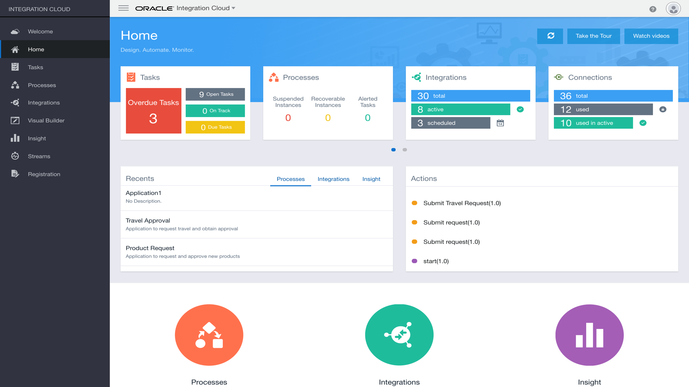

# **SaaS to EBS Integration Workshop**  
> ***Last Updated: March 2019***  

## Upgrade To Cloud: Oracle Integration Cloud (OIC) - Enterprise SaaS Integration Hands On Lab
A hands-on workshop to dive into development on Oracle's Integration Cloud Platform

## Overview
At Oracle we have invested in delivering a plethora of new Cloud Services and we want to show you how simple – yet powerful they are. We specifically wanted to focus on low code, high productivity services that can be used in building enterprise grade solutions. We believe the best way to do this is to showcase a real world business solution comprised of these services. You will build the entire solution during the course of this workshop all in a stress-free fun environment. 

This workshop will focus on the Integration Cloud  capabilities within Oracle Integration Cloud (OIC). Oracle ICS delivers best in class “Hybrid” Integration. ICS is a simple and powerful integration platform in the cloud to maximize the value of your investments in SaaS and on-premises applications. 

It includes an intuitive web based integration designer for point and click integration between applications and a rich monitoring dashboard that provides real-time insight into the transactions, all running on a mature runtime platform on Oracle Public Cloud. Integration Platform will help accelerate integration projects and significantly shorten the time-to-market through it's intuitive and simplified designer, an intelligent data mapper, and a library of adapters to connect to various applications.

## About OIC:

Oracle Integration Cloud (OIC) brings together all the critical capabilities of a complete Application Integration, Process Automation, Visual Application Building and Integration Analytics solution into a single unified cloud service. Oracle Integration Cloud now brings real-time and batch based integration, structured and unstructured processes, case management, stream analytics, zero code integration insight etc, allowing customers to service all their end to end integration needs in one cohesive platform so that all users can now transition and collaborate across these capabilities and projects seamlessly.

### Oracle Integration Cloud Features

- Integrate Applications - Deliver integrations up to 6X faster with pre-built adapters for your SaaS and on-premises systems.

- Automate Processes - Streamline your digital workforce with an easy, visual, low-code process automation platform that simplifies day to day tasks by getting employees, customers, and partners the services they need to work anywhere, anytime, and on any device.

- Build Applications Visually - Rapidly create and host engaging business applications with a visual development environment right from the comfort of your browser. Define business objects, integrate data from external system, incorporate business processes, and design tailored interfaces to create your apps.

- Gain Insight - Gain real-time insight into end-to-end processes with guidance on best next steps for your business operational excellence and run massively parallel real-time analytics on streaming data for instant actionable insights. 

## Hands-on Lab Overview
This hands-on lab will allow participants to do the following:
- Lab 100 – Workshop Pre-requisites and Exploring OIC 
- Lab 200 – Basic OIC Integration Development (Hello World Integration)
- Lab 300A – HCM and EBS Integration
    > - Set up HCM Adapter.
    > - Set up EBS Adapter.
    > - Create Scheduled Integration.
    > - Configure the HCM Connection.
    > - Add a Function Call.
    > - Mapping.
- Lab 300B – HCM and EBS Integration
    > - Add a Switch Action and configure a condition.
    > - Add a Loop Action.
    > - Configure EBS connection.
    > - Map to EBS Connector.
    > - Activate the Integration.
- Lab 400 – Run Scheduled Integration between HCM and EBS

## Get Started: 
Open the navigation menu using the hamburger icon in the upper left of the menu bar to choose a lab guide and get started.

The hamburger menu has an icon that looks like this: 
