# Lab 300 - Create an Integration by using an EBS and Fusion HCM (Atom Feeds) Adaptors

---

## Introduction

In this lab, you create an integration using the Scheduled Integration Orchestration. By adding HCM and EBS connections to the integration, newly created employees in HCM application will be synchronized with EBS system.  

The OAIC integration that we'll be building is shown in the following picture:

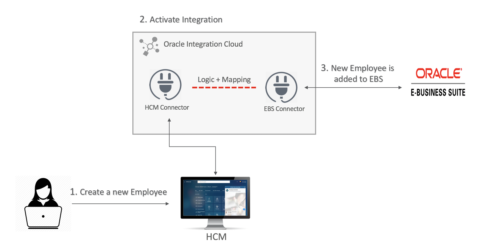

Here is a description of what is happening with this integration:

After a new employee had been created in Oracle HCM Cloud, HCM Atom feeds is triggered by Scheduled Integration. HCM Atom feeds provide notifications of Oracle Fusion Human Capital Management (HCM) events. When an event occurs in Oracle Fusion HCM, the corresponding Atom feed is delivered automatically to the Atom server. The feed contains details of the REST resource on which the event occurred. Subscribers who consume these Atom feeds use the REST resources to retrieve additional information about the resource, in our case it is a newly created employee. After, through EBS connector and proper mapping, that emploeey is synchronized with EBS application. 


## Objectives

- Explore ATOM feeds using Oracle's Fusion HCM
- Learn how to create EBS Adapter Connections
- Learn how to create a Scheduled Orchestration Orchestration with those Adapters
- Gain familiarity with working with switch actions and for each loops in OIC
- Test the integration

## Required Artifacts

- The following lab and an Oracle Integration Cloud account that will be supplied by your instructor.
- A HCM instance and connection URL that will be provided by your instructor.
- An EBS instance and connection URL that will be provided by your instructor.

## Create the HCM and EBS Connections

### Login to OIC Integration Home Page

---

- From your browser (Firefox or Chrome recommended) login to the OIC Integration Console using the following URL:

OIC Integration Home Page - https://**OAIC Instance URL**/ic/integration/home/faces/global

**OAIC Home Page URL** provided by your instructor

- Enter your `User Name` and `Password` and click **Sign In** if required

***NOTE:*** the **User Name and Password** values will be given to you by your instructor.

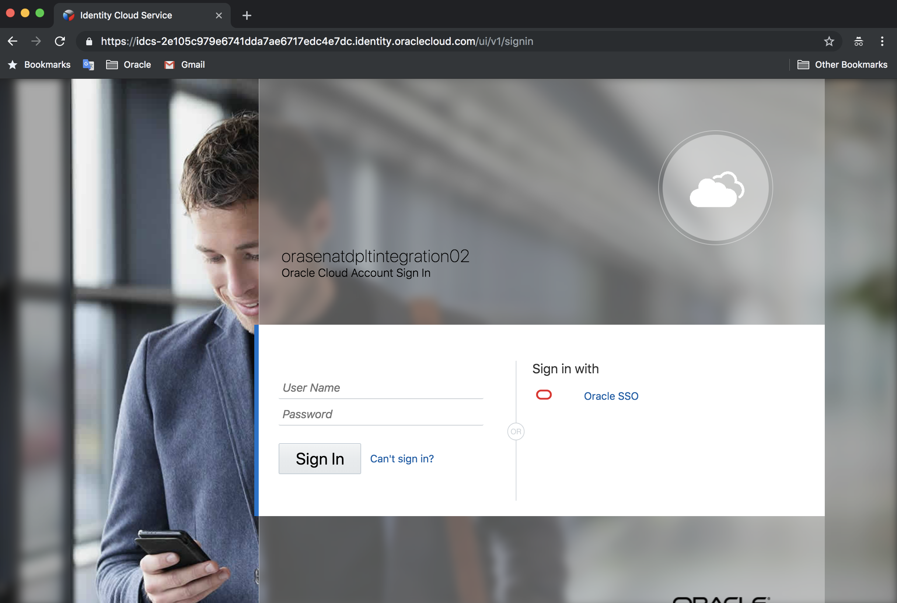  

------

You will now be presented with the OIC Service Console from which you will be performing the rest of this workshop lab.

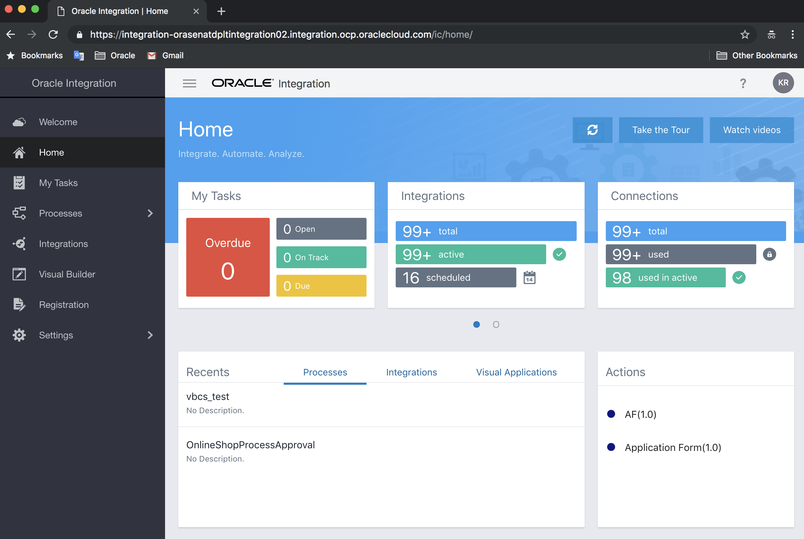

Select the an Integration Tab as it shown bellow

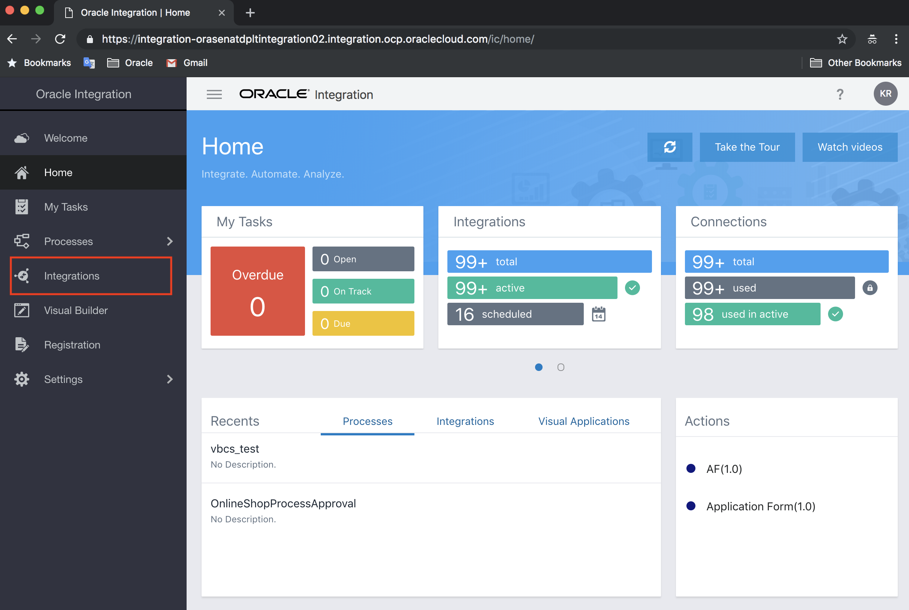


### Create the HCM Connector

---

- Select Integrations to open up Integration console. Then click the `Connections` in the left menu under Designer. And click on **Create** in the upper-right

	 

- Select the **Oracle HCM Cloud** Connection, by either doing a search, or by scrolling down to the  connection, then click on the **Select** button of the HCM connection.

	

- Fill in the information for the new connection 

	- **Name:** Enter in the form of _UserXX HCM where XX is the initials of the user.
	- **Role:** Select _Trigger and Invoke_ since OIC is smart enough to select one or another based on a use case of that connection.

    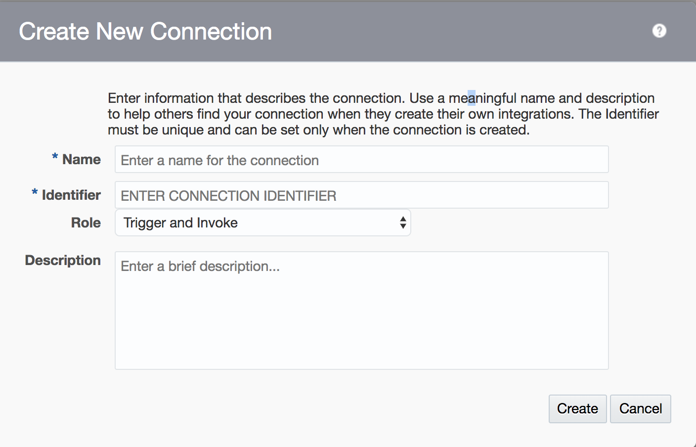

Note that the **Identifier** will automatically be created based on the **Name** you entered.

- Click **Create**

	 

- Click the **Configure Connectivity** button


- For the *WSDL URL*, enter the property value for the WSDL as follows:
	_hhttps://ucf1-edku-fa-ext.oracledemos.com/fscmService/ServiceCatalogService?WSDL_

Where _hhttps://ucf1-edku-fa-ext.oracledemos.com_ is your HSM instance URL

- Add an oPTIONAL Interface Catalog URL if you have one.
	 

- Select **OK**

- Select the *Configure Security* button insert your HCM **Username Password Token**. 

	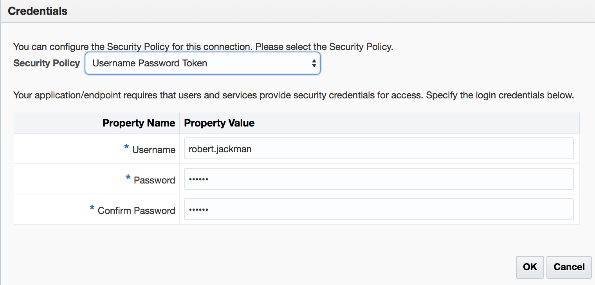

- At the top of the connection configuration screen, Click on the **Test** button to test the connection.

	

Note how the progress indicator will go from 85% to 100% after the connection tests successfully.
 

- Click on the **Save** button in the upper right corner of the connection configuration screen. And click on the **Close** button in the upper right of the connection configuration screen.

	 


Your new HCM connection appears in the list of configured connections.

 

### Create the EBS Connector

---

- Select the `Connections` graphic in the designer portal and click on *Create*

	 

- Select the *Oracle E-Business Suite* Connection, by either doing a search, or by scrolling down to the *Oracle E-Business Suite* connection, then click on the *Select* button of the *Oracle E-Business Suite* connection.

	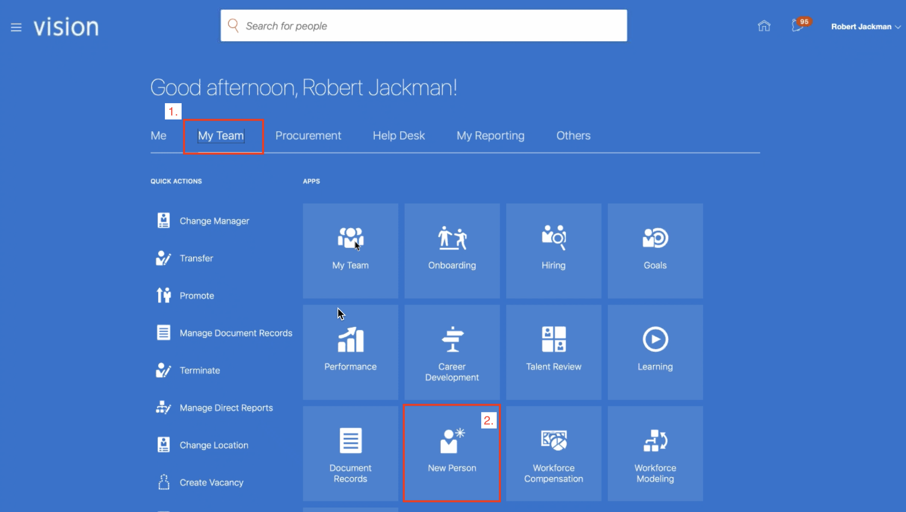

- Fill in the information for the new connection 

	- *Name:* Enter in the form of _UserXX EBS OPERATIONS_ where XX is your initials.
	- *Role:* Select _Invoke_ since we going to use the connection to invoke APIs from EBS

Note that the *Identifier* will automatically be created based on the *Name* you entered.

- Click *Create*

	

- Click the *Configure Connectivity* button

	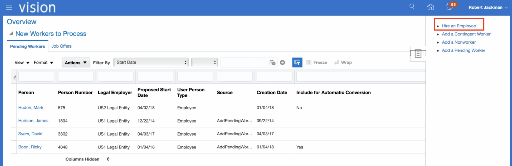

- Enter the *Connection URL* which you will be given by your instructor.  It will be in format like the following: `https://ucf4-ebs0116-gse.oracledemos.com`.

- After entering the *Connection URL*, select the *OK* button to save the value.

	

- Select the *Configure Security* button so we can change the default security configuration

	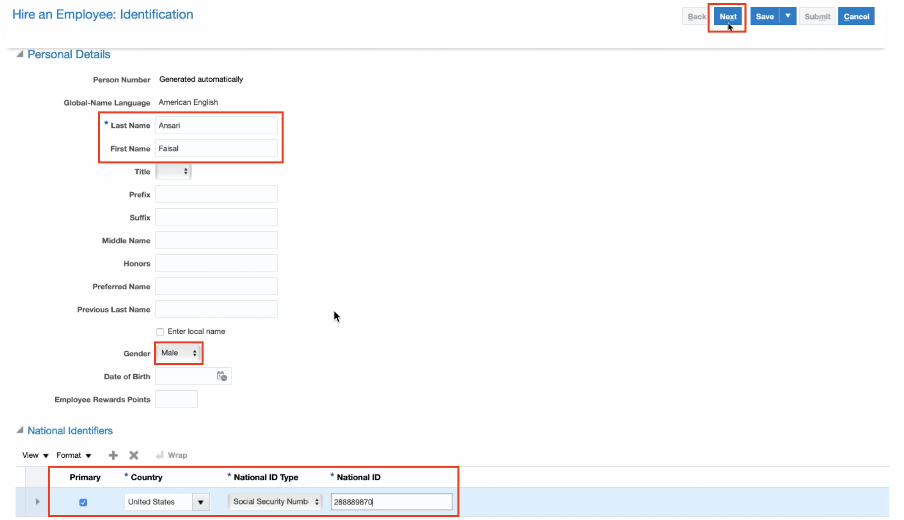

- Select the following options:

	- *Security Policy*: `Basic Authentication`
	- *Username*: `operations`
	- *Password*: `to be provided by your instructor`

After the security policy properties have been setup, click on the *OK* button to dismiss the dialog


- The connection needs to be tested by clicking on the *Test* button in the upper-right of the *UserXX EBS Operations* connection definition page.

	

- Now, select the *Save* button to save the connection configuration.

	

- Note that after the successful test, the percentage complete in the upper-right should go to *100%*.  After the save, a green banner message will appear in the top indicating a successful save operation.

- Finally, select the *Close* button to exit the connection configuration screen.

	

- You will now see your new **Oracle E-Business Suite** connection on top of the **Connections** list.

	

## Part 2: Create Scheduled Integration to synchronize a newly created employee with EBS system

### Create Scheduled Integration

- Select the *Integrations* link and click the **Create** button in the upper-right of the Integrations screen

	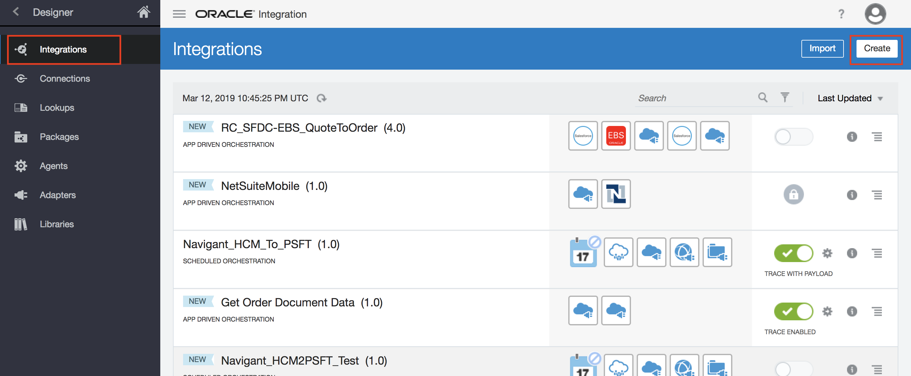

- In the **Create Integration - Select a Style**, select the **Scheduled Orchestration** style.  
That type of integration uses a schedule to trigger the integration instead of an adapter. Having Scheduled Orchestration you can schedule when to run it.

	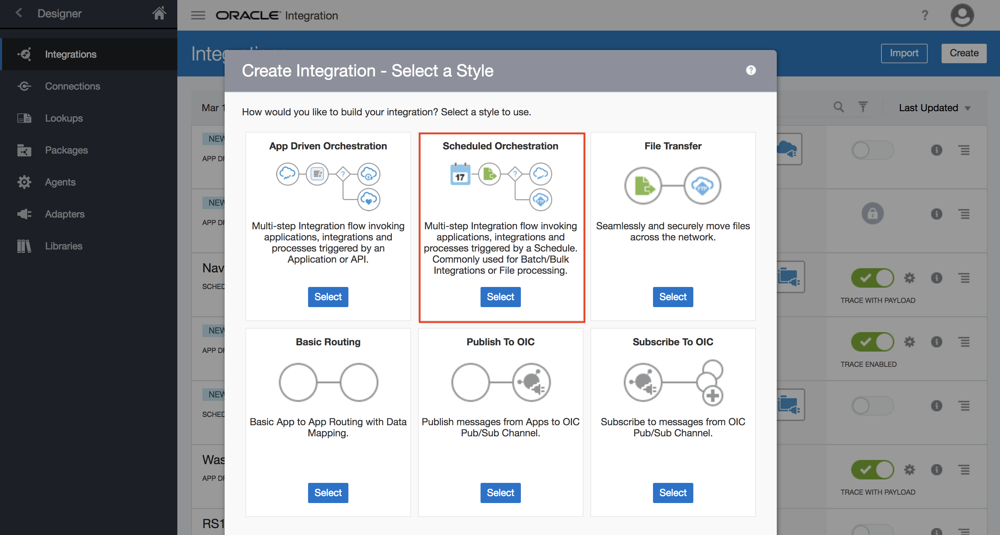

- Fill in the information for the new orchestration

	- **What do you want to call your integration?:** Enter the name in the form of _UserXX HCM to EBS_ where XX is your initials.
	- **Identifier:** Accept the default - this value will be generated based on the name you enter.
	- **Version:** Accept the default - if you want to clone and create newer versions later, you can change to a higher version than **01.00.0000** which is the default.

After you've filled in the information, select the **Create** button


- Observe the design canvas for the new integration.  (The various features of the OIC designer were covered in lab 100 **Exploring OIC** earlier in this workshop)

	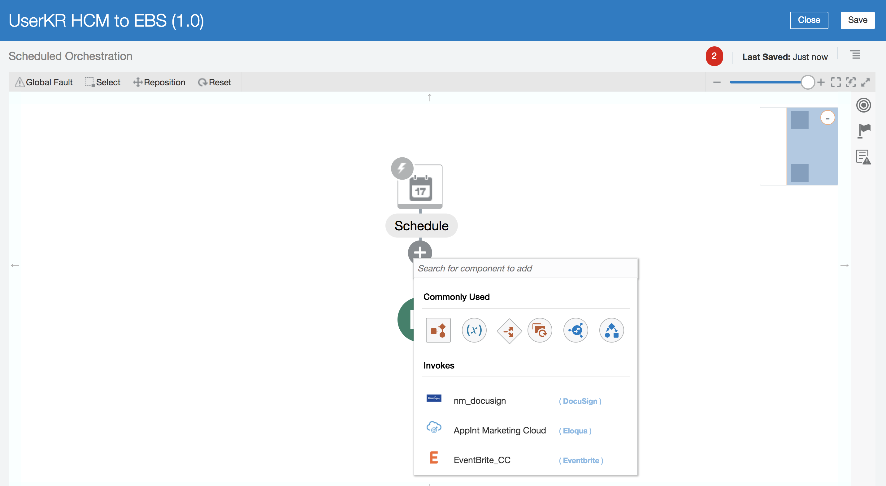


### Add HCM Connection
- Hover a pluss sign and search the HCM connection name that you created previously.

 

- Right after you will see _Configure Oracle HCM Cloud Endpoint_ wizard will pop up.

 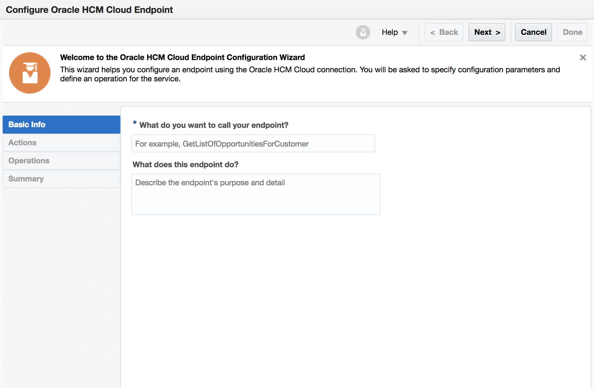

 - In the *Basic Info* section give the endpoint a name like `Get-HCM-Atom-Feed`.

 - After giving the invocation a name, select the *Next* button.

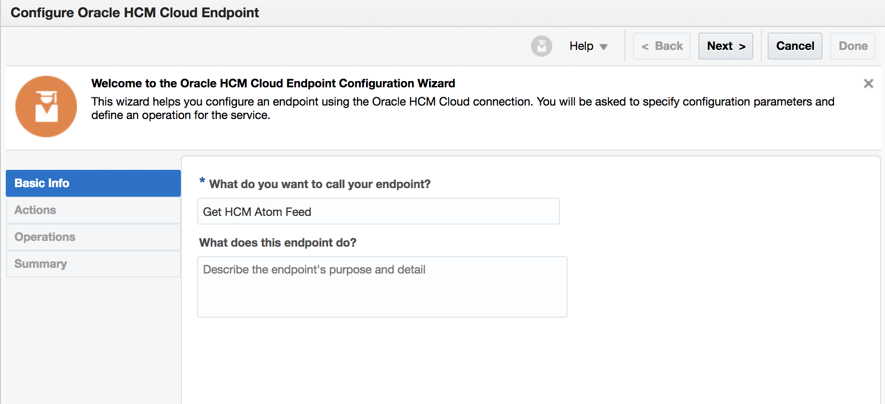

- In the *Web Services* section select **Subscribe to Updates(via ATOM feed). That option allows to receive latest updates since a specific date on new hires, jobs etc. Select the *Next* button.


- In the *Operations* section select _Employee New Hire_ as an atom feed. Afer, make shure you check the box for  _Include Business Object in the Event Notifications (ATOM Feeds)_. Select the *Next* button.

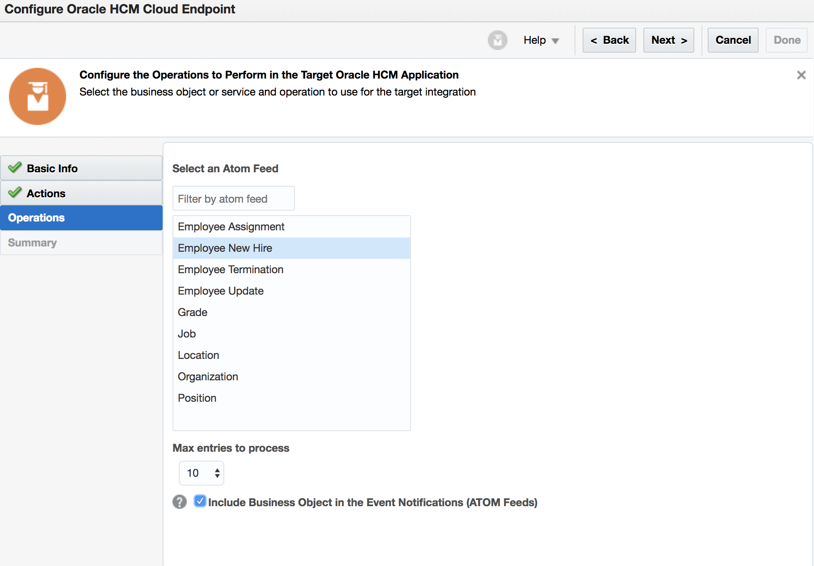

- In the *Summary* section of the configuration wizard, review the HCM connection which is going to be used, then select the *Done* button.


### Add a Function Call
- If you click on mapping sign.


- You are going to see _updated-min_ variable that is needed to be added for successful HCM invoking on the right side. The left side represents parametrs that are coming from our Scheduled Integration.

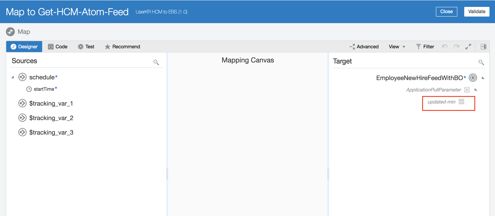

- Therefore, in order make a mapping for _updated-min_ variable we need to create a Function Call.

- Close the mapping window.
- Select a plus sign right after Schedule and search for _Function_.


- In Create Action insert `GetTimeStamp` name.

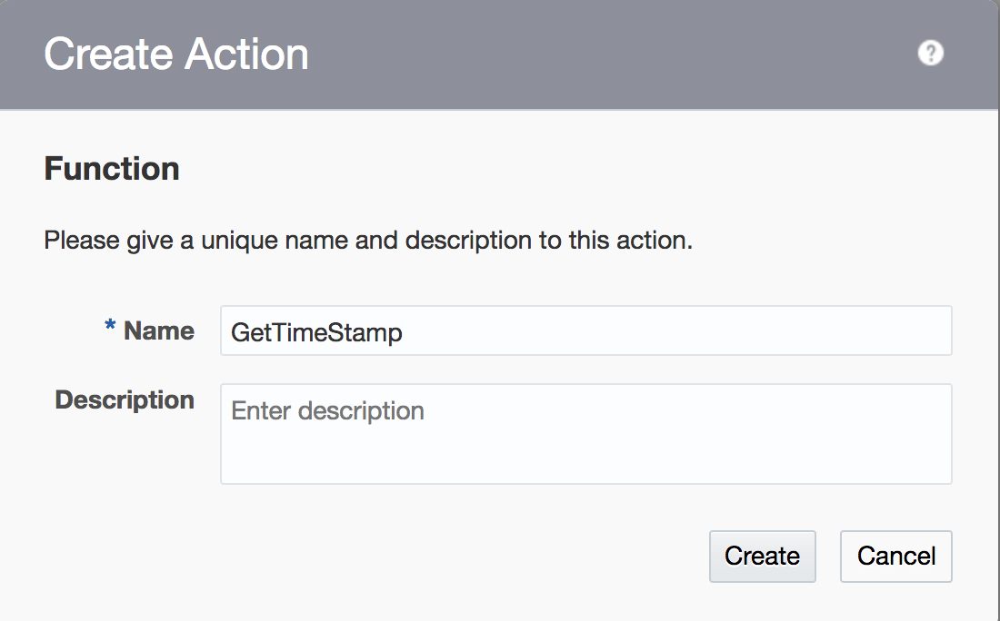

- After selecting **Create** you are going to see the window as shown bellow.

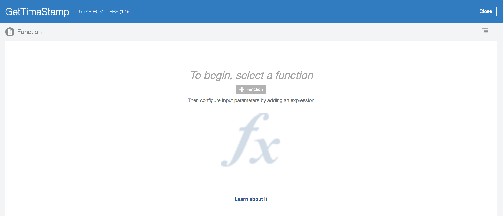

- Before selecting a Function make sure that function exists in Library.

---
---

-  If you have not created a function previously, skipp that section.

- Create a js file and save it in your PC

```
function addTime(ts, z) {
 var d = new Date(ts); 
 d.setMinutes(d.getMinutes() - z);
 var dt = d.toISOString();
  return dt;
}

```

- Novigate to **Library** from Designer Home page.

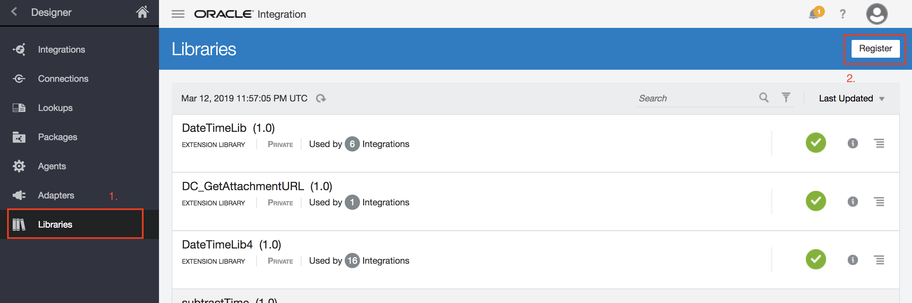


- Then select **Register**.

- In _Register Library_ wizard selct the js file that you just created and insert the required **Name**. Select Create button.

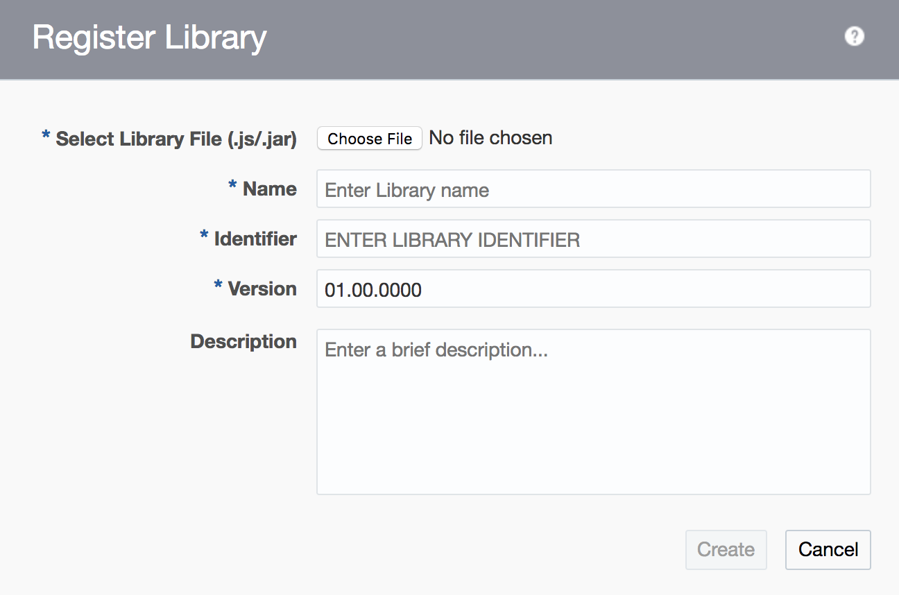

- By selecting **Orchestration** as a _Classification Type_ field for _Input_ and _Output_ will be prepopulated.

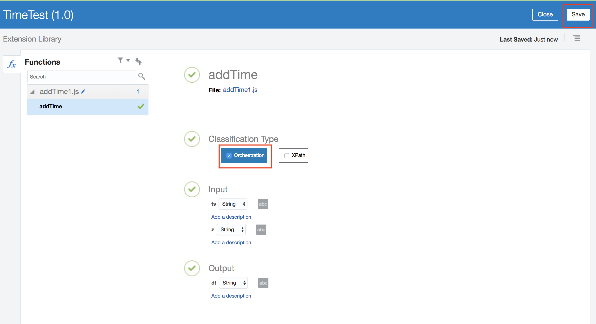

- Save and Close the window.

Now you can access that Function from your Integration Function Action.


- Come back to your Scheduled Integration,
---
---

- Select Function button

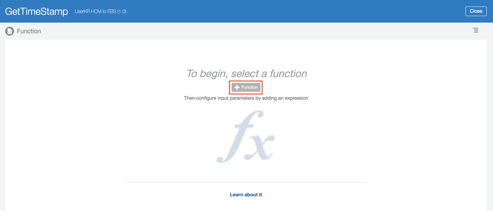

- Pick an appropriate function.


- Add Value to your _ts_ Parametr.


- Open **Function** folder and find **String Folder**

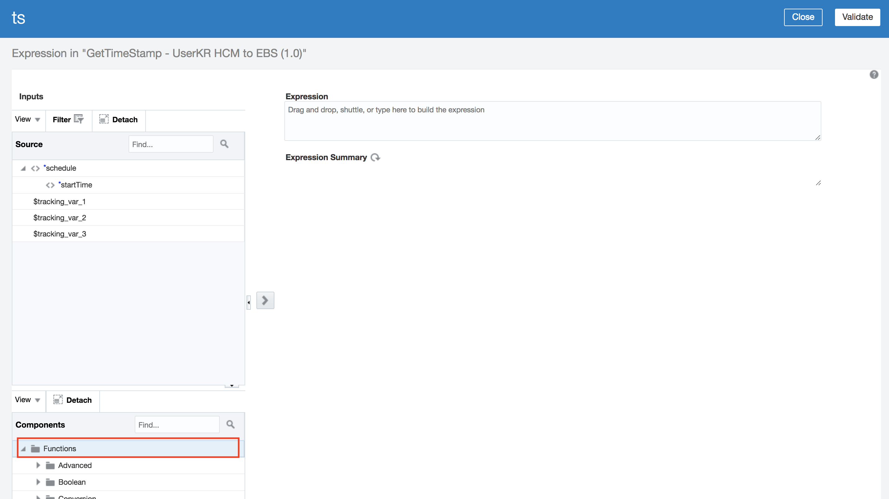

- There you can find _concat_ function. Select, drag, and drop it.


- At the end you want your expression looked like that picture bellow.

```
concat( substring-before( /nssrcmpr:schedule/nssrcmpr:startTime, "."),".000Z")
```
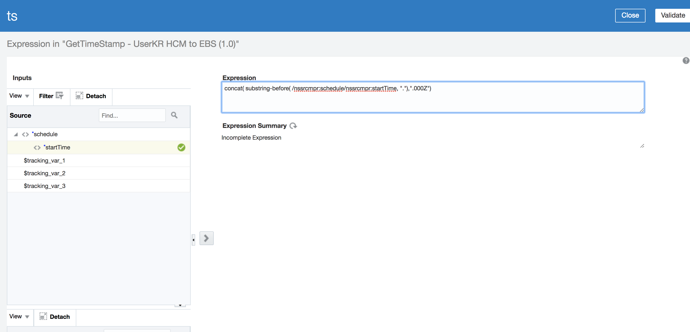

- Validate and Close the window.

- Add Value to _z_ Parameter 


- Assign 10.0 as an Expression. 

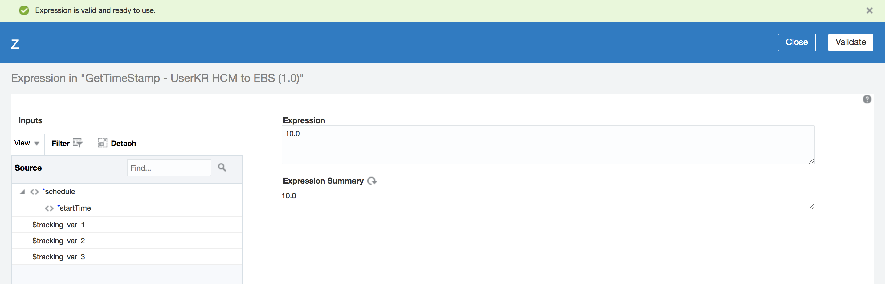

- Validate and Close the window.

- Validate your Function and Close the window.


### Mapping

[](images/300/26.png)

### Add the Invocation to EBS to the Orchestration

---

- Select *Invoke* on the right-hand navigation in order to open up the list of connections that were configured to be the *Invoke* type

- Select *Oracle E-Business Suite* connector types then click on the connector you just created (in the picture below it is the `User03 EBS OPERATIONS` connector)

- Click and drag the connection just under the *createOrder* invocation

	(_Note that the connector tray will go away after you select your connector and start to drag it_)


- Drop the connection on top of the blue plus sign landing zone which will appear just below the *createOrder* invocation

	

- In the *Basic Info* section of the _Configure Oracle E-Business Suite Adapter Endpoint_ wizard, give the endpoint a name like `EBS_Reference`.
	(_Note - In the figure it says createEBSOrder. In this lab, we'll proceed with EBS_Reference. But you can name anything._)

- After giving the invocation a name, select the *Next* button.

	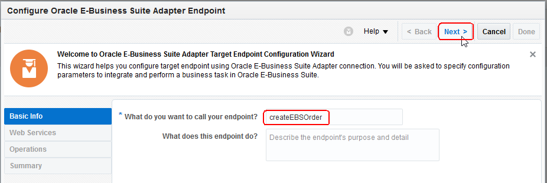

- In the *Web Services* section of the configuration wizard, for the *Product Family*, click on `=== Select ===` and then select `Order Management Suite`.  

(Note all the other EBS products for which APIs are available)


- Next, for the *Product*, click on `=== Select ===` and then select `Order Management`.  

(Note all the other EBS products for this suite which are available)

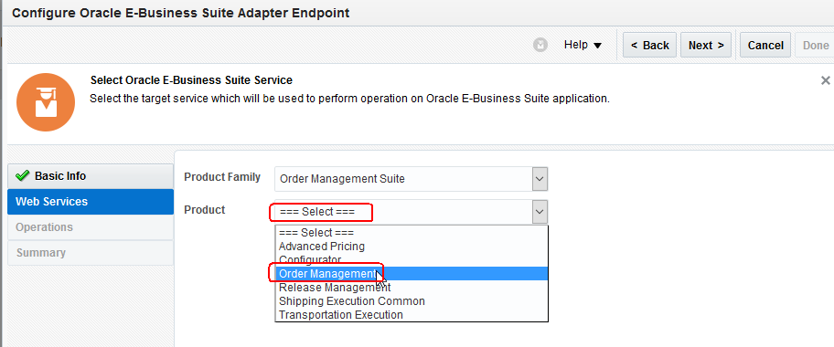

- Finally, for the *API*, scroll down and select the `Sales Order Services` API.  The *Internal Name* of `OE_INBOUND_INT` will automatically be populated.

- After selecting the API for the product family and product, select the *Next* button.

	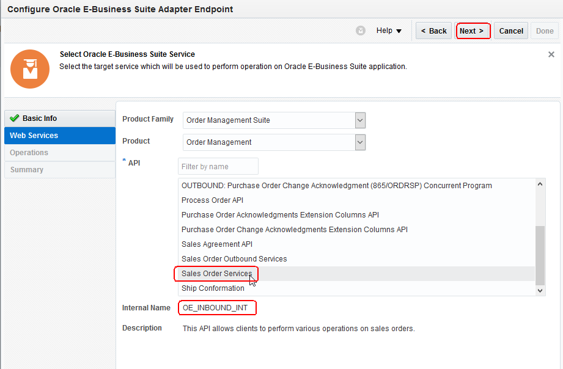

- In the *Operations* section of the configuration wizard, select the *Method* of `PROCESS_ORDER`, then select the *Next* button.

Note that the *Service Status* of `Ready to Use` indicates that the API has already been provisioned earlier from the EBS Integration Repository.


- In the *Summary* section of the configuration wizard, review the EBS API which is going to be used, then select the *Done* button.

	

- Observe that both the mapping and invocation to the EBS adapter now show up in the orchestration with the name `EBS_Reference`.  

	


### Add Constant Variables for EBS Mapping

---

- Before we modify the mapping for the `PROCESS_ORDER` API, it's a good practice in OAIC Integration to create some variables in an *Assign* action to simplify the mapping process.  The variables can then also be reused across multiple API invocations if necessary.

- Click on the `Start` icon in the upper right of the designer in order to zoom into the top of the orchestration

	

- Select *Actions* on the right-hand navigation in order to open up the list of available orchestration actions.

- Click on *Assign* then drag the action just under the *createOrder* trigger.  We're putting it there because we want to define our constant variables at the start of the orchestration.

Note that the action tray will go away after you select your connector and start to drag it


- Drop the *Assign* action on top of the blue plus sign landing zone which will appear just below the *createOrder* trigger

	

- Enter the *Name* of `initializeVariables` for this new assign action, then select the *Create* button.

	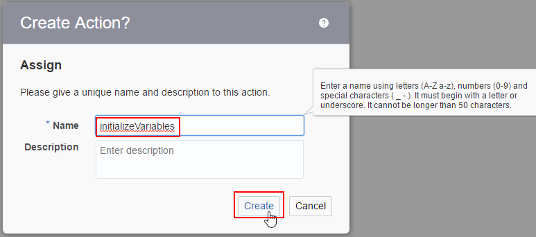

- Click on the Plus sign, then enter the variable name `EBS_Responsibility` in the *Name* column over the top of the default name `initializeVariables_assign_1` just to right of the little trash can.  Leave the `Data Type` as *simple*.

- Next, click on the little pencil icon on the very right of the variable definition table to bring up the expression editor.

	

- Enter the constant *Expression* of `"ORDER_MGMT_SUPER_USER"` (with double quotes), then hit the *Close* button.

	

- Select the little plus sign in the lower left of the variable table (just below to the little trash can) in order to add the next variable assignment.

	

- Enter the following variables into the assignment action one at a time following the procedure described in 2.4.7 -> 2.4.9:

	<table border=2, border-width=2>
	  <tr>
	    <th  style="background-color: #008000">Variable Name</th>
	    <th  style="background-color: #008000">Value</th>
	  </tr>
	  <tr><td>EBS_RespApplication</td><td>"ONT"</td></tr>
	  <tr><td>EBS_SecurityGroup</td><td>"STANDARD"</td></tr>
	  <tr><td>EBS_NLSLanguage</td><td>"AMERICAN"</td></tr>
	  <tr><td>EBS_OrgID</td><td>"204"</td></tr>
	  <tr><td>EBS_API_Version_Number</td><td>"1.0"</td></tr>
	  <tr><td>EBS_Sold_From_Org_ID</td><td>"204"</td></tr>
	  <tr><td>EBS_Price_List_ID</td><td>"1000"</td></tr>
	  <tr><td>EBS_Order_Type_ID</td><td>"1437"</td></tr>
	</table>

- After all the variables have been added to the assign action, select the *Validate* button to make sure all the assignments are valid and ready to use.

	

- Select the *Close* button to exit the *Assign* Action

	

### Map the **RESTHeader** and **InputParameters** Target Variables for the **createEBSOrder** API invocation

---

There are a total of 21 target variables that need to be mapped to successfully execute the EBS PROCESS_ORDER API call.  The next 3 sections will guide you through the process of mapping all these attributes.  Mapping many fields can be a common task while working with integrations.  OAIC Integration has the capability to do very complex mappings if necessary.

- The *createEBSOrder* mapping orchestration step is just above the corresponding *createEBSOrder* API invocation.

- Click on the double arrow mapping symbol to pop-up the edit pencil.

- Click on the little pencil to edit the mapping.

   

- Once the mapping editor is displayed, we can begin to map the constants we just previously created to the inbound payload for the EBS PROCESS_ORDER API

- We will first map the `Responsibility` target value.  Left-click and drag from the little circle just to the right of the `$EBS_Responsibility` variable in the Source variable list.

- Drop the `$EBS_Responsibility` on top of the little circle just to the left of the `Responsibility` variable in the Target on the right hand side of the mapping editor.

	

- Continue to map the first 6 constants according to the chart below

	<table border=2, border-width=2>
	  <tr>
	    <th  style="background-color: #008000">Source Variable Name</th>
	    <th  style="background-color: #008000">Target Variable Name</th>
	  </tr>
	  <tr><td>$EBS_Responsibility</td><td>Responsibility</td></tr>
	  <tr><td>$EBS_RespApplication</td><td>RespApplication</td></tr>
	  <tr><td>$EBS_SecurityGroup</td><td>SecurityGroup</td></tr>
	  <tr><td>$EBS_NLSLanguage</td><td>NLSLanguage</td></tr>
	  <tr><td>$EBS_OrgID</td><td>Org_iD</td></tr>
	  <tr><td>$EBS_API_Version_Number</td><td>P_API_Version_Number</td></tr>
	</table>

Note: The `Language` EBS RESTHeader variable doesn't need to be mapped


- Now we need to set the value of 3 of the EBS target variables to *True* by giving them the hard-coded value of `T`.

- Left-click on the Target variable `P_INIT_MSG_LIST` in order to bring up the advanced mapping editor.


- In the *Build Mappings* screen left-click on the field labeled *-- Drag and Drop or Type here...* to get into the edit mode.


- Now type the constant letter `T` (with no quotes).

- After entering the value `T`, click on the *Save*, then *Close* buttons.


- Repeat above steps for the following three target variables

	<table border=2, border-width=2>
	  <tr>
	    <th style="background-color: #008000">Target Variable Name</th>
	  </tr>
	  <tr><td>P_INIT_MSG_LIST (already done)</td><td>T</td></tr>
	  <tr><td>P_RETURN_VALUES</td><td>T</td></tr>
	  <tr><td>P_ACTION_COMMIT</td><td>T</td></tr>
	</table>

Progress Note: You have now already mapped 9 of the 21 target variables so we are 1/3 of the way to being completed!

- After setting the constant variables to `T`, expand the `P_HEADER_REC` variable so we can map the header record values

	

### Map the **P\_HEADER\_REC** Target Variables for the **createEBSOrder** API invocation

---

- There are hundreds of attributes in the `P_HEADER_REC` so we will leverage the *Search* field to find the fields we need to map.

- Map the `createOrderRequest -> Comment` variable over to `P_HEADER_REC -> ATTRIBUTE1`.  Click and drag the little circle just to the right of the source `Comment` variable and then drag and drop it on top of the little circle just to the left of the `ATTRIBUTE1` target variable.

	

- Next, enter the target attribute name `CUST_PO_NUMBER` in the search field, then click on the search *magnifying glass*.  The `CUST_PO_NUMBER` field will be display on top of the target variable list.

**IMPORTANT NOTE**: Do not hit the search button for the variable more than once because it will go to the 2nd `CUST_PO_NUMBER` field which is in the next EBS payload section called `P_OLD_HEADER_REC`.


- We need a unique number in the `CUST_PO_NUMBER` target field, so we will use an advanced XLST function to generate a random number between 0 and 12 digits.

- Click on the `CUST_PO_NUMBER` field to bring up the advanced mapping editor for that field.

	

- Open up the _Mapping Functions_ in the advanced mapping editor, then open up the _Advanced_ section.

- Click and drag the `generate-guid` XSLT function over to the `CUST_PO_NUMBER` target.

	

- In order to limit the size of the random GUID to 13 digits, we will use the XSLT _substring_ function.

- Close the _Advanced_ functions sections, then open up the _String_ section and scroll down so you can see the `substring` function.

- Drag and drop the `substring` function on top of the `generate-guid` function in the *Target* side of the mapping

	

- Select the radio button for *string* indicating that the generate-guid() function's value will be the base string for the substring function.  Select the _OK_ button to close the dialog.

	

- Next, enter the value _1.0_ for the starting location field of the substring.

	

- We need to give one more parameter to the `substring()` function for the ending index of the substring.  To add another parameter to the function, right-click on the substring() function, the select the menu item _Insert Child_ as shown in the following screenshot:

	

- Enter the value _12.0_ in the 3rd parameter for the `substring()` function and this advanced mapping is done.

	

- Select the _Save_, then _Close_ buttons

	

- Next, we want to set the current date to the `ORDERED_DATE` header target variable.  Enter the target attribute name `ORDERED_DATE` in the search field, then click on the search *magnifying glass*.

- Click on the `ORDERED_DATE` header target variable to open up the advanced mapping editor.

	

- Scroll down and select `Mapping Components` on the bottom left of the *Source* side.

NOTE: The mapping functions may already be open from the last `string` operation we used to create the `CUST_PO_NUMBER` field - in that case, just collapse the group of XSLT string functions then continue to the next step.

- Click and expand *Functions*, then click and expand *Date* functions.

- Drag and Drop the function `current-dateTime` into the area labeled `-- Drag and Drop or Type here...`

	

- Select the *Save* and *Close* buttons

	

- Search for and set the following `P_HEADER_REC` values:

	<table border=2, border-width=2>
	  <tr>
	    <th  style="background-color: #008000">Source Value</th>
	    <th  style="background-color: #008000">Target Variable Name in P_HEADER_REC</th>
	  </tr>
	  <tr><td>OrderTypeID</td><td>ORDER_TYPE_ID</td></tr>
	  <tr><td>$EBS_Sold_From_Org_ID</td><td>SOLD_FROM_ORG_ID</td></tr>
	  <tr><td>constant: <em>USD</em> (no quotes)</td><td>TRANSACTIONAL_CURR_CODE</td></tr>
	  <tr><td>constant: <em>CREATE</em> (no quotes)</td><td>OPERATION</td></tr>
	  <tr><td>SOLD_TO_ORG_ID</td><td>AccountID</td></tr>
	</table> 

- We have mapped a lot of values and it's difficult to see what has been accomplished on the Target side because we were using the *Search* feature.  In order to make it easy to see what has been mapped, we will apply a *Filter* to the target variable side.

- Click on the *Filter* button on the *Target* side of the mapping editor.

- In the *Filter* dialog box in the *Is it Mapped?* section, select the radio button `Mapped`, then select the *Apply* button.

	

- You will now have a good view of all the currently mapped fields in the *RESTHeader*, *InputParameters*, and *P_HEADER_REC* target variable sections.

- Compare your work to the screenshot below:

	

- It is a good practice to occasionally save your work during a long mapping exercise.  Click on the *Validate* button in the upper right of the mapper to save your work up to this point.

Progress Note: You have now already mapped 16 of the 26 target variables so we are 62% of the way to being completed!

### Map the **P\_LINE\_TBL** Target Variables for the **createEBSOrder** API invocation

---

- There are still 11 target fields left to map. 

- We need to remove the target filter so we can find the final fields to map.  Click on the *Filter* button on the *Target* side of the mapping editor.

- In the *Filter* dialog box in the *Is it Mapped?* section, select the radio button `All Fields`, then select the *Apply* button.

	

- In the *Search* field on the target side, enter the string `P_LINE_TBL`, then click on the little magnifying glass icon.

- Expand the `P_LINE_TBL` target node by clicking on the little chevron just to the left of the variable.

- Map the source `createOrderRequest -> Lines -> linesArray` variable over to the `P_LINE_TBL_ITEM` target variable.  A *for-each(Lines)* XSLT expression is automatically added for this mapping because both the source *Lines* and the target *P_LINE_TBL_ITEM* are both arrays since there can be more than one line item in an order.

	

- Expand the `P_LINE_TBL_ITEM` node, the enter `INVENTORY_ITEM_ID` in the target Search box then hit the search button (magnifying glass).

- If you want to be sure what the path to the target element you just searched for is, you can linger over the element to see that what it's path is as shown in the screenshot below:

	

- Map the source variable `ItemID` over to the target `INVENTORY_ITEM_ID` as shown below.

	

- Continue to map the following source values into the `P_LINE_TBL_ITEM` target variables as shown in the following table:

(Note: You can continue to use the search box or just scroll down - the target variables are in alphebetical order)

<table border=2, border-width=2>
  <tr>
    <th  style="background-color: #008000">Source Value</th>
    <th  style="background-color: #008000">Target Variable Name in P_LINE_TBL_ITEM</th>
  </tr>
  <tr><td>createOrderRequest -> ItemID</td><td>INVENTORY_ITEM_ID (already mapped)</td></tr>
  <tr><td>createOrderRequest -> Quantity</td><td>ORDERED_QUANTITY</td></tr>
<!--  <tr><td>$EBS_Price_List_ID</td><td>PRICE_LIST_ID</td></tr>
  <tr><td>Mapping Components -> Functions -> Date -> current-dateTime()</td><td>PRICING_DATE</td></tr>
  <tr><td>constant in advanced mapper: <em>204</em> (no quotes)</td><td>SHIP_FROM_ORG_ID</td></tr>   -->
  <tr><td>createOrderRequest -> Price</td><td>UNIT_SELLING_PRICE</td></tr>
<!--  <tr><td>constant in advanced mapper: <em>CREATE</em> (no quotes)</td><td>OPERATION</td></tr>
  <tr><td>constant in advanced mapper: <em>N</em> (no quotes)</td><td>CALCULATE_PRICE_FLAG</td></tr>  -->
</table>

Progress Note: You've mapped the 21 target variables and are almost done... but let's make sure we mapped everything correctly so far.

- Once again, we have mapped a lot of values and it's difficult to see what has been accomplished on the Target side because we were using the *Search* feature.  In order to make it easy to see what has been mapped, we will apply a *Filter* to the target variable side.

- Click on the *Filter* button on the *Target* side of the mapping editor.

- In the *Filter* dialog box in the *Is it Mapped?* section, select the radio button `Mapped`, then select the *Apply* button.

	

- You will now have a good view of all the currently mapped fields in the *RESTHeader*, *InputParameters*, and *P_HEADER_REC* target variable sections.

- Compare your work to the screenshot below:

	

- It is a good practice to occasionally save your work during a long mapping exercise.  Click on the *Validate* button in the upper right of the mapper to save your work up to this point.


### Test the Updated Mapping

---

- OAIC has a built-in test harness so that you can see if the changes you made to your mapping actually work.

- First, select the *Test* button just below the *Validate* button just pressed.

	

- Next, select the `Generate Inputs` button in the upper-right of the testing window.

	

- We want to put an interesting comment in the input `<ns0:Comment>` element in the `Input: createOrderRequest` incoming payload.

- Edit the data in the generated inbound payload to something custom.  In this example it was set to *This is my Comment!*

	

- Now that the input data is ready, select the `Execute` button in the upper-right of the test window.

	

- The mapping will be applied to the generated input data and the result will be shown in the `Output: PROCESS_ORDER_Input` section on the right side of the test window.

- Look for your custom comment and note that it has been mapped to the `P_HEADER_REC` -> `ATTRIBUTE1` element.

- Now that we have seen that our mapping has been successfully modified, we can close the test window. Select the `Close` button in the lower-right of the test window.

	

- Now we can close the Mapping Editor because our changes have been made and tested.

- Click on the `Close` button in the upper-right of the Mapping Editor.

	

- If you haven't validated your changes to save them before you selected the `Close` button, a dialog box will appear asking if you want to apply your changes.  Select _Apply_ to apply your changes before closing the mapping editor.

	

- Save your changes made to the integration by pushing the `Save` button in the upper-right of the integration.

	

### Remap the Return Payload

---

- Scroll down to the bottom of the orchestration and open up the *createOrder* mapping action.

	

- In the mapping editor, scroll the bottom of the Source variables and then expand the `$createEBSOrder -> PROCESS_ORDERResponse -> OutputParameters` variable by clicking on the little chevron just to the left of the variable.

- After expanding the `OutputParameters`, then expand the `X_MESSAGES` source variable and then the `X_MESSAGES_ITEM` variable.

- Click and drag the `X_MESSAGES_ITEM` source variable over to the target `ErrorMsgs -> Message` variable.

	

- Click on the `Message` field to bring up the advanced mapping editor for that field.

	

- Expand the _Source_ fields to expose _MESSAGE_TEXT_ field under `OutputParameters -> X_MESSAGES -> X_MESSAGES_ITEM`

- Click and drag the `MESSAGE TEXT` over to the `<nstrqmpr:Message>` target.

	

- Select the `Save`, then `Close` buttons

	

- Click and drag the source variable `X_RETURN_STATUS` over to the target `Status` variable

	

- Next, expand the source variable `X_HEADER_REC`, then in the search box on the source side, enter the string `ORDER_NUMBER` then select the search button (little magnifying glass)

	

- Map the `ORDER_NUMBER` source variable over to the `OrderNumber` target variable.

	

- Click on the *Validate* button in the upper right of the mapping editor.

- Now, click on the *Close* button in the upper right of the mapping editor.

	

- From the orchestration, select the *Save* button to save all the changes made to the final mapping for the return payload.

- We are now completed with the design steps of the orchestration for Lab 400.  Finally, *Save* your integration and select the *Close* button in the upper right of the orchestration designer.

	

### Activate Changes to the Integration

---

- Click on the *Activate* switch/slider on the right of the `UserXX Create EBS Order` integration.

	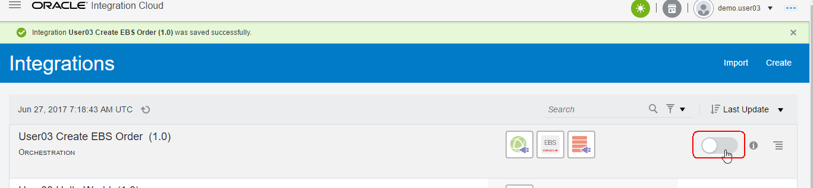

- The `Activate Integration?` dialog will be displayed

- Select the *Enable tracing* and *Include Payload* checkboxes since this isn’t a production deployment.  The checkboxes will tell OAIC that the payloads for each instance of the integration will be saved in the logfiles as explored in the first part of this lab earlier.

- Now select the *Activate* button to begin activation of the integration.

	

- Once the integration is activated you will see that the activation slider now is colored green with a checkmark in it.

- A message will appear on the top of the OAIC Designer Portal indicating that the integration activation was successful.  The WSDL for the service endpoint will also be displayed.

	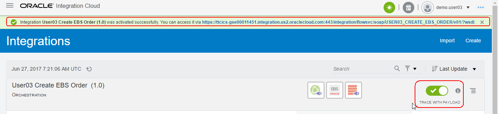

###	Check the Service Endpoint

---

- Click on the WSDL link so we can ensure that this integration has an available service endpoint.

	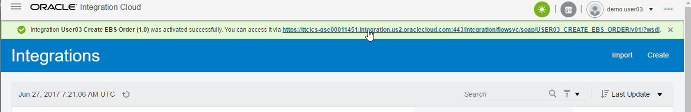

- The WSDL for you new OAIC integration will now be displayed in your browser.

- Copy the WSDL URL into your copy buffer so we can test it in the next lab section.

	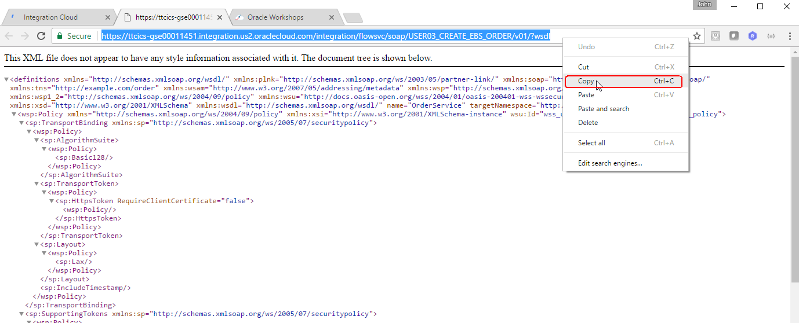

- Now that we have built and activated an integration and copied it's service endpoint, we can test it with some sample data to make sure it works.

## Part 3: Test the OAIC Integration

---

### Test Using SoapUI

- Open SoapUI.  If you don't already have this installed, follow the instructions provided in the **Prerequisites** section of this workshop.

	

- Click on the **SOAP** button so we can create a new project for testing our new OAIC SOAP Web Service

	

- In the **New SOAP Project** dialog window, paste the WSDL URL into the **Initial WSDL** window and give a meaningful **Project Name** such as _User03 Create EBS Order Lab 400_.  Keep the checkbox selected for **create sample requests for all operations?**.  Click on the **OK** button after you've initialized the settings for your new SoapUI SOAP project.

	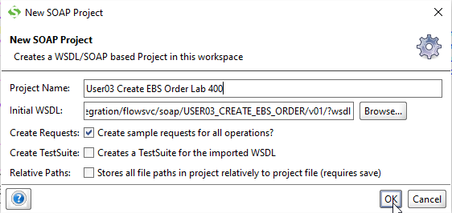

- The new SOAP Project will appear in the left-hand navigation.

- Expand the **createOrder** operation by clicking on it, then open the auto-generated sample request **Request 1** by double-clicking on it.  An empty request payload will be generated.

	

- In the request payload, as in Lab 300, replace the question marks with the following test values:

	- **AccountName**: _Imaging Innovations, Inc._
	- **AccountID**: _1002_
	- **OrderTypeID**: _1430_
	- **Comment**: _Lab 400 request from SoapUI_
	- **ItemID**: _2155_
	- **Item**: _AS18947_
	- **Price**: _1208_
	- **ITemDescription**: _Sentinel Deluxe Desktop_
	- **Category**: _COMPUTER_
	- **Qty**: _1_
	- **UOM**: _Ea_


	

- Next we need to add the authorization credentials so OAIC will allow the request from SoapUI.  OAIC uses basic username/password authentication.

- Click on the **Auth** button in the lower-left of the **Request 1** SoapUI window

- In the **Authorization** dropdown, select _Add New Authorization..._

	

- In the **Add Authorization** dialog pop-up window, select **Type** of _Basic_ form the picklist, then select the **OK** button.

	

- Fill in your assigned username and password in the **Auth (Basic)** window at the bottom of the SoapUI request window

	

- OAIC needs two headers in the request payload to satisfy the enforced Web Services Security (WSS) standards.  It needs both the **WSS Username Token** and the **WS-Timestamp**.

- Insert the **WSS Username Token** by right-clicking in the Request payload body and select **Add WSS Username Token** from the pull-down list

	

- In the **Specify Password Type** dialog pop-up window, select _PasswordText_ as the WSS Username Token type, then click on the **OK** button.

	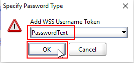

- Insert the **WS-Timestamp** by right-clicking in the Request payload body and select **Add WS-Timestamp** from the pull-down list

	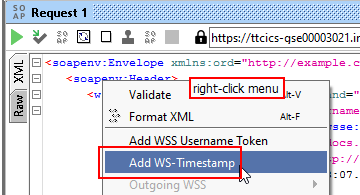

- In the **Specify Time-To-Live value** dialog pop-up window, set the value (in milliseconds) to _60000_ (60 seconds), then click on the **OK** button.

	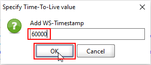

- Finally your request payload is ready to send to OAIC.

- Click on the green _Submit Request_ arrow in the upper left of the **Request 1** window.

	

- The right side of the **Request 1** SoapUI window will display the results of the OAIC integration call.

- The return payload of the OAIC integration will show the Order Number and the status of `S` for _Success_.

	

### Verify the Order was Created in EBS

---

- Login to EBS using the endpoint and credentials provided to you by the workshop organizer.  You will use the user *operations*.

	- *NOTE:* For the EBS instance used in this workshop, the Oracle Single Sign-On system is used to regulate access.  Unless individual users are explicitly added to have access to the EBS system, they will not be able to access the following EBS login page.  If you can't access the login page with your Oracle SSO login, then you can look at the following screenshots to see how you would be able to see your Order in an EBS R12.2 system.

	

- Select the EBS Responsibility *Order Management, HTML User Interface*:

	

- Examine the list in the *Open Orders* report and verify that your new order shows up in the list.

Note that the _Order Amount_ shown is larger than that of the quote because of shipping costs and taxes that were added automatically by EBS .


You have now completed the final lab of the OAIC Developer Workshop.  

Congratulations! You should now have a much better understanding of how to work with OAIC to create complex integrations.