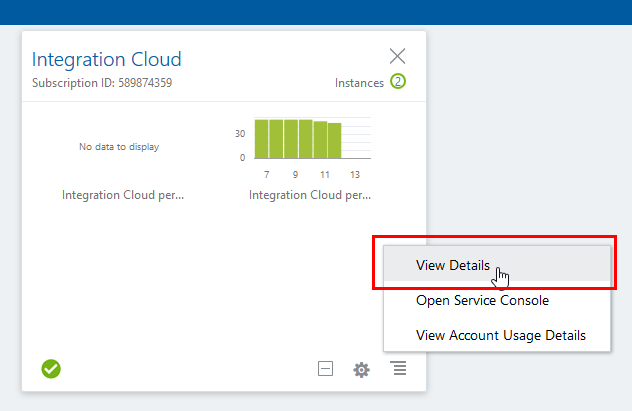
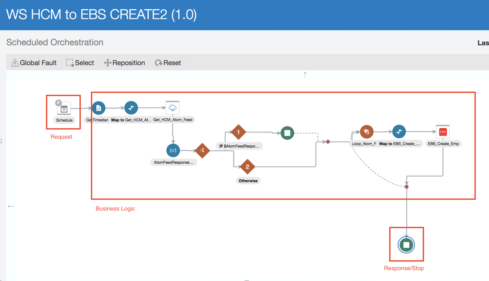

# **Lab 100 - Explore Oracle Integration Cloud (OIC)**

## **Introduction**

This is the first of several labs that are part of the **OIC Development** workshop. 

In this lab, we will explore the main parts of Oracle Integration Cloud (OIC).  You will acquire a good overview of OIC, the next generation integration platform. You will explore various consoles and tools available to interact with your integration. The exercise will get your familiar with all the tooling available to work with this cloud service: 

1.	Oracle Cloud Services Dashboard
2.	OIC Designer User Interface (Integrations and Connections)
3.	OIC Monitoring User Interface

## **Objectives**

- Explore Oracle Integration Cloud (OIC) to become familiar with its service console and functionality

## **Pre-Requisites**

- This lab assumes that you have already completed Lab 000

## **Required Artifacts**

- The following lab
- An Oracle Public Cloud account that will be supplied by your instructor

# **Getting Started**

## **Explore the Oracle Integration Cloud**

## **100.1: Explore the Dashboard**

**100.1.1:** From your browser (Firefox or Chrome recommended) go to the following URL:
<https://cloud.oracle.com>

**100.1.2:** Click `Sign In` in the upper right hand corner of the browser
**IMPORTANT** - Make sure `Cloud Account with Identity Cloud Service` is selected Under Cloud Account, Enter **Cloud Account Name** provided by your instructor and Click on the `Next` button

**100.1.3:** Enter the ***Username*** and ***Password*** provided to you by your instructor then click **`Sign In`**

  

**100.1.4:** You will be presented with a Dashboard displaying the various cloud services available to this account

> **NOTE:** The Cloud Services dashboard is intended to be used by the *Cloud Administrator* user role.  The Cloud Administrator is responsible for adding users, service instances, and monitoring usage of the Oracle cloud service account.  Developers and Operations roles will go directly to the service console link (https://{**InstanceName**}-{**CloudAccountName**}.integration.ocp.oraclecloud.com/ic/home/), not through the service dashboard

**100.1.5:** The Service Administrator can also look at Billing and Monitoring Metrics to understand how the service is being consumed by your Enterprise. Selecting `View Details` link will take you to the Service Overview page where there are links for Billing and Monitoring Services
> As this is a demonstration account, there is no Billing and Monitoring information available

**100.1.6:**  To get to the OIC Home Page where you will work on developing the integration, we have to go through the service console. Click on `Open Service Console` to display the OIC Service Instance Page listing all OIC Services provisioned in the Cloud Account

**100.1.7:**  Click on the `Hamburger` menu  for the OIC Instance your lab proctor has instructed and select the `Open Integration Cloud Home Page` link to go to the OIC Welcome Page

> **NOTE:** If you get an **Authentication Required** Pop-Up Window to re-enter user credentials, select `Cancel` to continue. 

**100.1.8:**  Click on the `Home` link to go to the OIC Home Page to explore the dashboard

 

**100.1.9:**  Click on `Integrations` and you will now be presented with the Integration Console from which you will be performing the rest of this lab

 

## **Explore the OIC Designer User Interface**
---
## **100.2: Explore Connections**

**100.2.1:** From the integration designer menu, select connections

**100.2.2:** Click on the `Create` button in the upper-right so we can see all the prebuilt OIC Adapters that are available

 

**100.2.4:** Scroll through the list of available adapters. When you are done browsing, select the `Cancel` button to dismiss the “Select an Adapter” dialog
> **NOTE:** The icons with the plug support the OIC Connectivity Agent for those service types which are not in the cloud, but on-premise, behind the company firewall

## **100.3: Explore Integrations**

**100.3.1:** If not already showing, select the `Hamburger` menu icon  on top of the OIC Service Console to reveal the `Designer` menu

**100.3.2:** Select the `Integrations` menu item

**100.3.3:** Select the `Hamburger` menu icon  again to dismiss the left-hand navigation and get some screen real-estate back

> **NOTE:** In this lab we will be building HCM to EBS integration from scratch. If you do not see **WS HCM to EBS CREATE2** click the Load More option or filter by the keyword **WS** at the top right of the page. 

**100.3.4:** Open the integration `WS HCM to EBS CREATE2` by clicking on the integration name. 

**100.3.5:** You can see that this orchestration has many steps in it.  The view of the orchestration is *Zoom to Fit* in the browser real estate.  In order to get a closer view of the individual steps, you can either scroll with your mouse wheel to zoom in and out, or you can use the *-/+* slider in the top right of the designer

- ***Try zooming in and out by using both methods***

**100.3.6:** If you get zoomed-in too close and want to pan, you’ll be able to move around the orchestration using the `Pan` window by clicking on the dark area and moving around

**100.3.7:** Select the `Lightning` icon to reset to a zoomed in view with the orchestration trigger at the very top.  This is a nice feature if you don't know where you are in a large orchestration

**100.3.8:** 
- Try selecting the `Maximize` viewing control on the very right of the view control bar.  
This will hide some of the detail on top of the screen to give the designer the most area to work in. 
- Clicking on the `Maximize` button again will toggle that view.

- Now, let’s look at some of the components of the integration. Select the `Maximize` view button again to restore the window.

 

**100.3.9:** Creating an integration you have an option to select a type of integration.

Selecting App Driven Orchistration, your integration should start with a ***Trigger***

- The trigger is representative of the connector that’s sending data into the integration.  It is highlighted with a little lightning bolt signifying an incoming event.

Today, we are going to use Scheduled Orchistration. You can schedule the running of integrations. For example,you can create an orchestrated integration that is triggered by a schedule. 

**100.3.10:** Extension libraries provide a means to register and organize JavaScript for use in integrations. Library functions are automatically available for you to drag from the Actions palette to your orchestration integrations.

**100.3.10:** In order for custom function calls to appear in the integration Actions palette, you must register the libraries that contain them. In our case you can see the function addTime was registered and parameters as ts and z were configured.

**100.3.11:** Next we will take a look into our `mapping`  action.
- What you’ll see in the mapper is the possible input variables on the left and the response payload on the right.

**100.3.12:** 
- Once you are done exploring this mapping, select the `Close` button in the upper-right to be returned to the Integration orchestration.

**100.3.13:** After Mapping you can see `Get_HCM_Atom_Feed`. This connection is a window to our HCM application. During the lab you will be able to set it up by yourself.

**100.3.14:** Now let’s view the next downstream node which is an *Assign* action. The job of this Assign activity is to initialize variables that will be used in our application. Again we are going to click on `AtomFeedResponseCount` to see what our assign activity accomplishes.

**100.3.15:** Using assigned variables rather than hard-coding it  in the mapping is preferable because they can be re-used throughout the integration and easily edited to affect the entire integration

> ***NOTE:*** that we are creating a variable called **AtomFeedResponseCount**

- Select the `Close` button in the upper-right to return to the view of the orchestration

**100.3.16:** Pan down to `Switch` statement which creates multiple possible paths based on certain conditional statemets being true or false. 
- We can check those parameters by clicking on the brown "`1`" to inspect
- Here we can see the conditional statement for continuing on that path. 
    - The logic behind the switch statement is as follows: If **AtomFeedResponseCount == 0.0** then take this path, if not take the other path.

**100.3.17:** Our assignmet keeps track of newly created employees in HCM. In that case, since it equals 0 our integration complets. Otherwise, the integration enters the loop and perform the action iteratively - add newly created employees into EBS.

- We’ve spent some time exploring the *WS HCM to EBS CREATE2* integration. Now we are ready to look into integration monitoring.

## **Explore the OIC Monitoring User Interface**

## **100.4a: Explore Monitoring Console**

**100.4a.1:** From the integration designer menu, select the `Designer` menu item to navigate to the secondary menu level

**100.4a.3:** Next, select the `Monitoring` menu item to navigate to the OIC monitoring capabilities

**100.4a.4:** Next, select the `Dashboards` menu item to navigate to the main OIC monitoring dashboard page

## **100.4b: Explore Monitoring Dashboard**

**100.4b.1:** You will be presented with the OIC Monitoring Dashboard
- Observe the various data that is available from this dashboard such as:
    - *percentage of successful messages*
    - *number of currently used connections*

  

**100.4b.2:** On the right side of the Dashboard there are links where you can view the _Activity Stream_, _Download the logs_, and _Download Incident_ if a service request needs to be raised

**100.4b.3:** Click on the _`Activity Stream`_ link

**100.4b.4:** You will be directed to the *Integration* screen where you can view a summary of all messages that have passed through OIC in a tabular form
- In the *Activity Stream* below, you can see the steps in integrations that were executed and whether or not they were successful.

## **100.4d: Explore Monitoring Integrations**

**100.4d.1:** Back in the OIC Monitoring console, select `Integrations` from the left-hand navigation

**100.4d.2:** Review all the statistics that are shown

## **100.4e: Explore Monitoring Tracking**

**100.4e.1:** Select the `Tracking` link in the navigation bar on the left. The OIC `Tracking` monitor page shows all of the individual integration flows that have been executed

**100.4e.2:** Select the chevron just to the right of the *Tracking* label at the top of the page to change the granularity of the Tracking report to `Last 1 Hour`

**100.4e.3:** Next, drill into a `COMPLETED` integration flow by selecting the integration name.

**100.4e.4:** We can now see that all steps in this OIC integration flow were successful because of the green highlighting all the orchestration flow steps

**100.4e.5:** Select the `Close` button to go back to the OIC monitoring page.

We are now done exploring the OIC monitoring features.

--- 

# **THIS LAB IS NOW COMPLETED**
> In the next lab, you will learn how to create a basic 'Hello World' echo service
