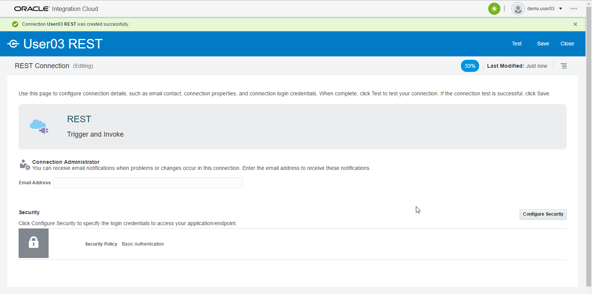
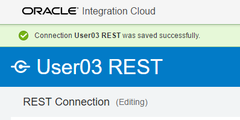
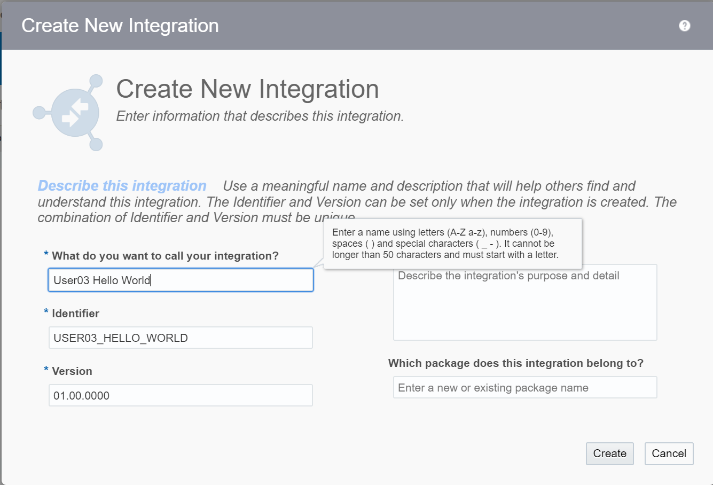
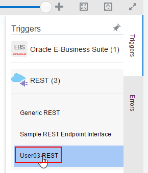
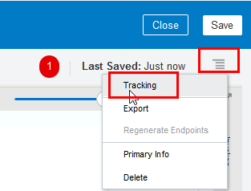

# **Lab 200: Basic OIC Development (Hello World Integration)**

## **Introduction**

This is the second of several labs that are part of the **Oracle Integration Cloud (OIC) Integration Development** Workshop. 

In this lab, you will learn how to create a basic 'hello world' echo service, using a basic orchestration. 

The OIC integration that we'll be building is shown in the following picture:


> ***Here is a description of what is happening with this integration:***
>
> Postman will be used to test the exposed REST API Service endpoint of the OIC integration called ***UserXX Hello World*** (where XX will be the Number assigned by the Instructor). This integration has one connection.  The incoming message is received by the incoming ***UserXX REST*** REST Connection. The integration flow will take the Input String and echo it back in the REST API response.

## **Objectives**

- Create a connection
- Create your first integration to echo an input to the output 

- **RECOMMENDED:**
    - It is recommended that you have completed Lab 100

## **Required Artifacts**

- The following lab 
- An Oracle Public Cloud account that will be supplied by your instructor

# **Getting Started**

## **200.1: Log In to OIC and Nagivate to the Integration Designer Page**

**200.1.1:** Navigate to the Home Page by using the OIC URL provided to you by your instructor. The URL should have the following pattern: 
https://{**InstanceName**}-{**CloudAccountName**}.integration.ocp.oraclecloud.com/ic/home/

**200.1.2:** Log in to Oracle Cloud console

  

**200.1.3:** From the home page, select *Integrations* and you should be automatically redirected to the Integration Designer Page where you will see a list of the all the integrations available on the environment.


## **200.2: Create a REST Connection**

**200.2.1:** Click on the **Integrations** link to be redirected to the Integrations Designer page where you will select the **Connections** link

  

 

**200.2.2:** On the connections page, click the **Create** button in the upper right

 

**200.2.3:** Select the **REST** adapter: 
- You can search for it in the search bar   
  **_OR_**
- By scrolling through the alphabetical list of adapters until you get to the adapter labeled **REST**

Then, click on the **Select** button of the **REST** card


**200.2.4:** Fill in the information to create the new connection then, click the **Create** button

- **Name:** _UserXX REST_ where XX is the number or initials in your allocated user ***check with your instructor which to use***
- **Role** _Trigger_ since we are going to use the connection as a trigger to start the integration

 

 

**200.2.5:** Click on the **Test** button. When prompted with the success message, click **Save**


**200.2.6:** When prompted with the success message, click on the **Close** button 
> Your newest connections appear in the list of all connections and is also marked with a **New** ribbon

 


## **200.3: Create a New Integration**

**200.3.1:** Next, we will configure our integration. Click on the **Integrations** link in the upper left to return to the Integration page

 

**200.3.2:** Click on the **`Create`** button in the upper right

 

**200.3.3:** In the **Create Integration - Select a Style** window, select ***App Driven Orchestration***


**200.3.4:** On the Create New Integration form, give the integration the _name:_ **UserXX Hello World**, where XX is replaced by the user's initials, and click on the **`Create`** button




**200.3.5:** In the **Triggers** panel, expand the **REST** heading, and find your **USERXX REST** connection we previously configured

Drag and drop your connection **UserXX REST** in to the circle with plus sign, you will see the plus sign twirling when ready to drop 

> You can also just click on the circle with the plus sign in its center to bring up a floating menu of available connections
 
 --> 


**200.3.6:** A configuration wizard will open where you will fill in the following values starting on the **Basic Info** page:

- **What do you want to call your endpoint?** _echo_
- **What is the endpoint's relative resource URI** _/echo_
- **What action does the endpoint perform?** _POST_
- **Configure a request payload for this endpoint** _Checked_
- **Configure for this endpoint to receive a response** _Checked_
- **Configure CORS (Cross Origin Resource Sharing)** _Checked_

when complete, click **Next** to navigate to the _Request_ tab


**200.3.7:** Select **JSON Sample**, under the section *Select the request payload file* and for _enter sample JSON_ click on **`<<< inline >>>`** to open the Sample JSON window


**200.3.8:** Copy and paste the JSON seen below into the **Enter Sample JSON** window, click **`Ok`** to save and exit then, select **`Next`** to navigate to the _CORS Configuration_ tab

```javascript
{
    "echo": "String to echo"
}
```


**200.3.9:** Enable **CORS** for all domains, by entering **\*** in the **Allowed Origins** field then, click **`Next`** to navigate to the _Response_ tab


**200.3.10:** Select **JSON Sample**, under the section *Select the request payload file* and for _enter sample JSON_ click on **`<<< inline >>>`** to open the Sample JSON window


**200.3.11:** Copy and paste the JSON seen below into the **Enter Sample JSON** window, click **`Ok`** to save and exit then, select **`Next`** to navigate to the _Summary_ tab

```javascript
{
    "return": "String to echo"
}
```


**200.3.12:** Click **Done** to return to the integration flow


**200.3.13:** Click on the **Map to echo** icon and then select the _pencil_ icon to open the mapping configuration

  --> 


**200.3.14:** Drag the **<\>echo** field and drop it over the **<\>return** 

> Alternatively, you can click on the circle just to the right of the **<\>echo** and drop it onto the circle just to the left of **<\>return**


**200.3.15:** Click on **Validate** then Click on **Close** in the upper right


> You will notice that the **Map to echo** icon is filled in _all blue_ now indicating that it has been completely configured.


**200.3.16:** Click on the _Hamburger_ icon in the upper right, then select **Tracking**



**200.3.17:** Drag **<> \*echo** across to the right hand side, under **Tracking Field** then click on **Done**


**200.3.18:** Click on **Save** and then **Close** to exit the integration design canvas


> You should see your _New_ integration in list of _Integrations_


## **200.4: Activate Your Integration**

**200.4.1:** Click on the switch icon next to your integration to activate


**200.4.2:** On the **Activate Integration** popup window:
- select the checkbox **Enable Tracing**
- select the checkbox **Include payload**
- click on the **Activate** button


**200.4.3:** To get the endpoint URL, click on the gear icon  as shown below to open documention about your integration


## **200.5: Test Using Postman**

**200.5.1:** Click on the `Endpoint URL` it will take you to a new page where we will copy our endpoint URL to your clipboard


**200.5.2:** Next, we will open the Postman App. In the URL bar, paste the copied URL and change the method to _POST_


**200.5.3:** Click on the **Authorization** tab as shown below


**200.5.4:** Change the Authorization settings as follows:

- **Type:**     _Basic Auth_

- **Username:** _demo.userXX_

- **Password:** _YOUR PASSWORD FOR OIC_


**200.5.5:** Click on the **Body** tab, select the **raw** radio button and **JSON(application/json)** is selected from the dropdown.
- Enter the following text in the body text box:

````javascript
{
    "echo":"Hello World!"
}
````


**200.5.6:** 
- Click on the blue **Send** button 
- Look at the bottom to see the output
- The Status should indicate a **200 OK** 
- The Body should contain the following value:
````git statusjavascript
{
    "return":"Hello World!"
}
````


--- 

# **THIS LAB IS NOW COMPLETED**

