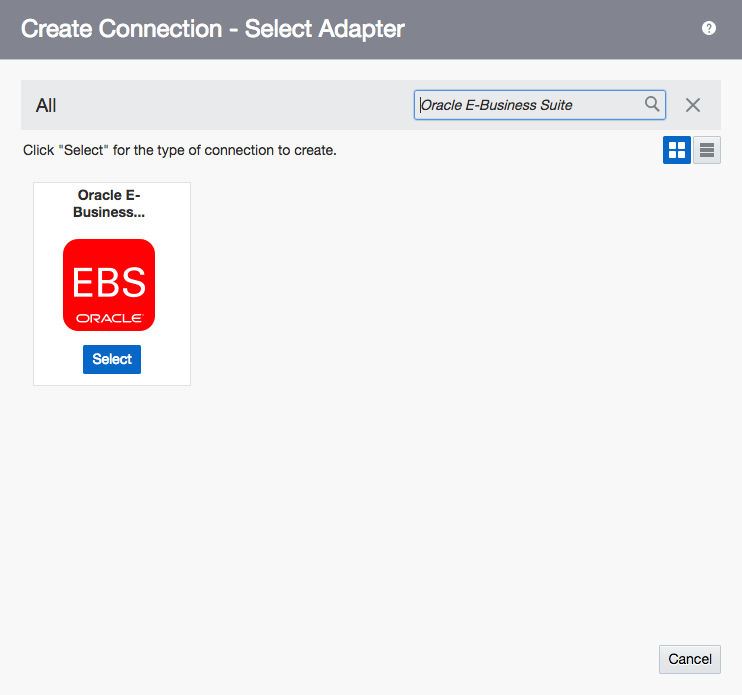
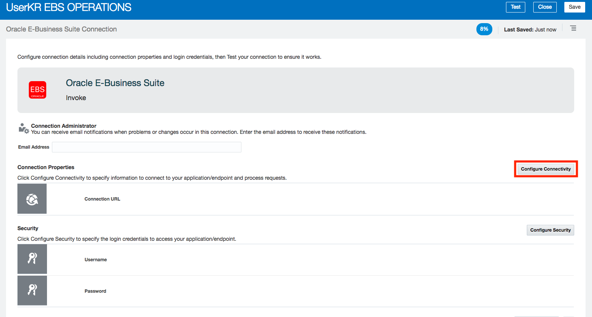
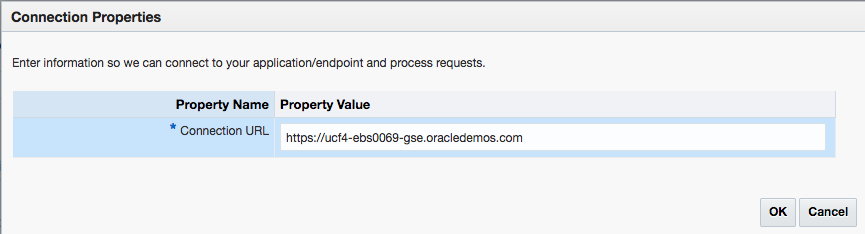
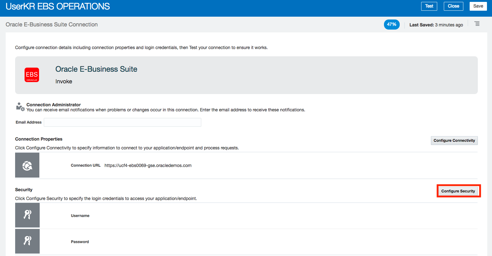
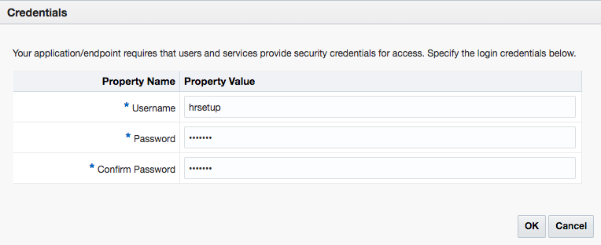
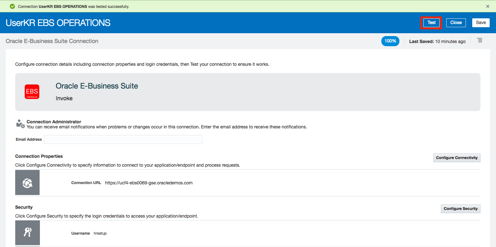
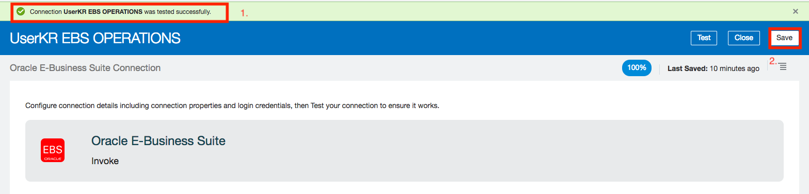
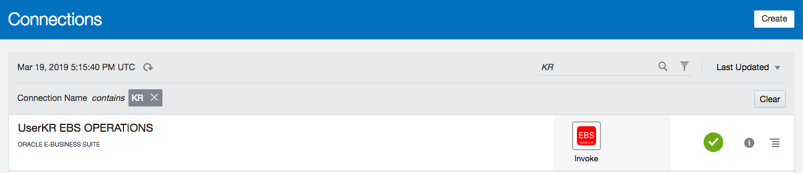
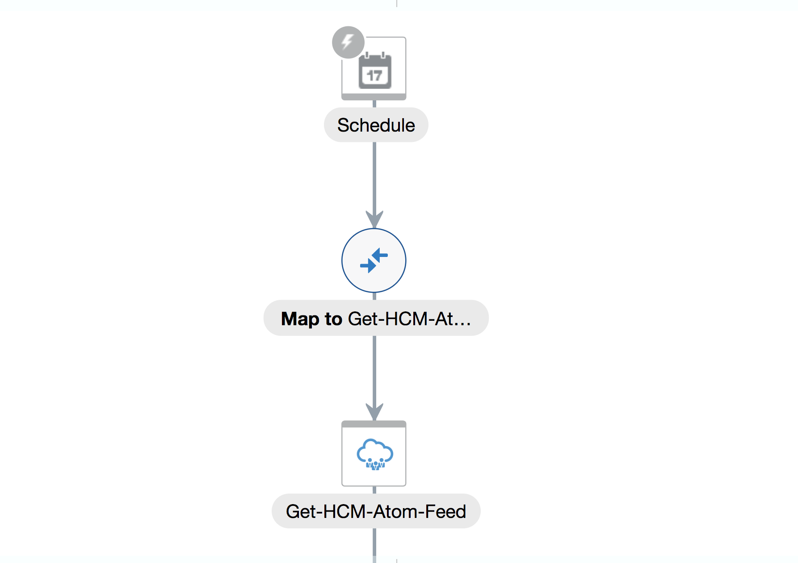
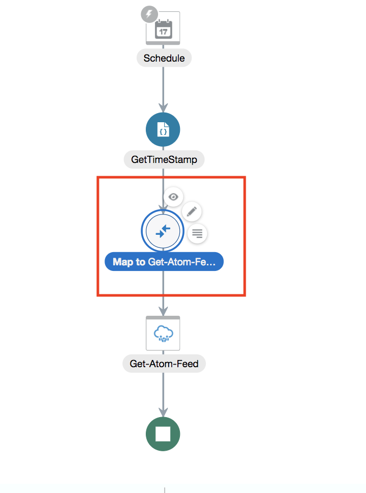

#  **Lab 300 - Part A: Oracle Integration Cloud (OIC) Development Workshop**

# **HCM and EBS Integration: Fusion HCM with ATOM Feeds Development Lab**
> ***Last Updated: March 2019***  

## **Introduction**

> This lab is part of a series of OIC Development workshops created to provide users with hands-on experience building functional integrations in the cloud using Oracle Integration Cloud. In this lab, we will configure the connections and other parts of OIC that will be utilized in Lab 300B. This lab assumes that you are already somewhat familiar with the OIC interface and logged into the instance.

> In this lab, you create an integration using the Scheduled Integration Orchestration. The integratio will be responsyble for synhronizing a newly created employee in HCM into EBS.

> The OIC integration that we'll be building is shown in the following picture:


> Here is a description of what is happening with this integration:

 > After a new employee has been created in Oracle HCM Cloud, an HCM Atom feeds is triggered by the Scheduled Integration. HCM Atom feeds provide notifications of Oracle Fusion Human Capital Management (HCM) events. When an event occurs in Oracle Fusion HCM, the corresponding Atom feed is delivered automatically to the Atom server. This feed contains details of the REST resource in which the event occurred. Subscribers who consume these Atom feeds use the REST resources to retrieve additional information about the resource; in our case it is a newly created employee. After this is completed, the employee is synchronized with the EBS application using the EBS connector and proper mapping.


## **Objectives**

> 1. Set up HCM Adapter.
> 2. Set up EBS Adapter.
> 3. Create Scheduled Integration.
> 4. Configure the HCM Connection.
> 5. Add a Function Call.
> 6. Configure Mapping.

## **Required Artifacts**

- The following lab and an Oracle Integration Cloud account that will be supplied by your instructor.
- An HCM instance and connection URL that will be provided by your instructor.
- An EBS instance and connection URL that will be provided by your instructor.

### **300a.1: HCM Adapter Set Up**
- Select Integrations to open up the Integration console. Then click the `Connections` in the left menu under Designer. And click on **Create** in the upper-right

	 

- Select the **Oracle HCM Cloud** Connection, by either doing a search, or by scrolling down to the  connection, then click on the **Select** button of the HCM connection.

	

- Fill in the information for the new connection 

	- **Name:** Enter in the form of _UserXX HCM where XX is the initials of the user.
	- **Role:** Select _Trigger and Invoke_ since OIC is smart enough to select one or another based on a use case of that connection.

    

Note that the **Identifier** will automatically be created based on the **Name** you entered.

- Click **Create**

	 

- Click the **Configure Connectivity** button


- For the *WSDL URL*, enter the property value for the WSDL as follows:
	_https://ucf1-edku-fa-ext.oracledemos.com/fscmService/ServiceCatalogService?WSDL_

Where _https://ucf1-edku-fa-ext.oracledemos.com_ is your HSM instance URL

- Add an oPTIONAL Interface Catalog URL if you have one.
	 

- Select **OK**

- Select the *Configure Security* button insert your HCM **Username Password Token**. 

	

- At the top of the connection configuration screen, Click on the **Test** button to test the connection.

	

Note how the progress indicator will go from 85% to 100% after the connection tests successfully.
 

- Click on the **Save** button in the upper right corner of the connection configuration screen. And click on the **Close** button in the upper right of the connection configuration screen.

	 


Your new HCM connection appears in the list of configured connections.

 

### **300a.2: EBS Adapter Set Up**
- Select the `Connections` graphic in the designer portal and click on *Create*

	 

- Select the *Oracle E-Business Suite* Connection, by either doing a search, or by scrolling down to the *Oracle E-Business Suite* connection, then click on the *Select* button of the *Oracle E-Business Suite* connection.

	

- Fill in the information for the new connection 

	- *Name:* Enter in the form of _UserXX EBS OPERATIONS_ where XX is your initials.
	- *Role:* Select _Invoke_ since we going to use the connection to invoke APIs from EBS

Note that the *Identifier* will automatically be created based on the *Name* you entered.

- Click *Create*

	

- Click the *Configure Connectivity* button

	

- Enter the *Connection URL* which you will be given by your instructor.  It will be in format like the following: `https://ucf4-ebs0116-gse.oracledemos.com`.

- After entering the *Connection URL*, select the *OK* button to save the value.

	

- Select the *Configure Security* button:

	

- Select the following options:

	- *Username*: `It is the username of your EBS instance`
	- *Password*: `It is the password of your EBS instance`

After the security policy properties have been setup, click on the *OK* button to dismiss the dialog




- The connection needs to be tested by clicking on the *Test* button in the upper-right of the *UserXX EBS Operations* connection definition page.

	

- Select the *Save* button to save the connection configuration.

	

- Note that after the successful test, the percentage complete in the upper-right should go to *100%*.  After the save, a green banner message will appear in the top indicating a successful save operation.

- Finally, select the *Close* button to exit the connection configuration screen.

- You will now see your new **Oracle E-Business Suite** connection on top of the **Connections** list.

	

### **300a.3: Create Scheduled Integration**
- Select the *Integrations* link and click the **Create** button in the upper-right of the Integrations screen

	

- In the **Create Integration - Select a Style**, select the **Scheduled Orchestration** style.  
That type of integration uses a schedule to trigger the integration instead of an adapter. Having Scheduled Orchestration you can schedule when to run it.

	

- Fill in the information for the new orchestration

	- **What do you want to call your integration?:** Enter the name in the form of _UserXX HCM to EBS_ where XX is your initials.
	- **Identifier:** Accept the default - this value will be generated based on the name you enter.
	- **Version:** Accept the default - if you want to clone and create newer versions later, you can change to a higher version than **01.00.0000** which is the default.

After you've filled in the information, select the **Create** button


- Observe the design canvas for the new integration.  (The various features of the OIC designer were covered in lab 100 **Exploring OIC** earlier in this workshop)

	


### **300a.4: Configure the HCM Connection**
- Hover over the plus sign and search for the HCM connection name that you created previously.

 

- Right after the _Configure Oracle HCM Cloud Endpoint_ wizard will pop up.

 

 - In the *Basic Info* section give the endpoint a name like `Get-HCM-Atom-Feed`.

 - After giving the invocation a name, select the *Next* button.


- In the *Web Services* section select *Subscribe to Updates(via ATOM feed)*. That option allows to receive latest updates since a specific date on new hires, jobs etc. Select the *Next* button.


- In the *Operations* section select _Employee New Hire_ as an atom feed. Afer, make sure you check the box for  _Include Business Object in the Event Notifications (ATOM Feeds)_. Select the *Next* button.


- In the *Summary* section of the configuration wizard, review the HCM connection which is going to be used, then select the *Done* button.




### **300a.5: Add a Function Call**
- If you click on mapping sign.


- You are going to see _updated-min_ variable that is needed to be added for successful HCM invoking on the right side. The left side represents parameters that are coming from our Scheduled Integration.


- Therefore, in order make a mapping for _updated-min_ variable we need to create a Function Call.

- Close the mapping window.
- Select a plus sign right after Schedule and search for _Function_.


- In Create Action insert `GetTimeStamp` name.


- After selecting **Create** you are going to see the window as shown below.


- Before selecting a Function make sure that function exists in Library.

---

-  If you have addTime function to appear in the list of functions in the Library, skip that section.

- Create a JavaScript (.js) file and save it in your PC

```
function addTime(ts, z) {
 var d = new Date(ts); 
 d.setMinutes(d.getMinutes() - z);
 var dt = d.toISOString();
  return dt;
}

```

- Navigate to **Library** from Designer Home page.


- Then select **Register**.

- In _Register Library_ wizard select the .js file that you just created and insert the required **Name**. Select the Create button.


- By selecting **Orchestration** as a _Classification Type_, the fields for _Input_ and _Output_ will be prepopulated.


- Save and Close the window.

Now you can access that Function from your Integration Function Action.


- Come back to your Scheduled Integration

- Select Function button


- Pick an appropriate function.


- Add Value to your _ts_ Parametr.


- Open **Function** folder and find **String Folder**


- There you can find _concat_ function. Select, drag, and drop it.


- At the end you want your expression looked like that picture bellow.

```
concat( substring-before( /nssrcmpr:schedule/nssrcmpr:startTime, "."),".000Z")
```


- Validate and Close the window.

- Add Value to _z_ Parameter 


- Assign 10.0 as an Expression. 


- Validate and Close the window.

- Validate your Function and Close the window.


### **300a.6 Mapping**
- Now it's time to configure the mapping between the timestamp and the Atom feed.

- Open the **Map** as it shown below.



- And make a connection by dragging and dropping a point from the fuction call `GetTimeStamp` to _updated-min_ variable from HCM connection. That time stamp is needed so the system will know what point in time it should refer to to load new employees.


- Validate the mapping and Close the window

### **300a.7: Assign a Variable**
- To assign a variable, click on the flag icon 

  

- Drag and drop the Assign Icon (found under the Data label) to the integration flow directly under the _getNewHireATOMFeed_ icon

 --> 


- A window will open where you will provide the action with a unique name _AtomFeedResponseCount_ and if you'd like a short description then click the Create button

  

- On the config page set the following values:


- On the variable column, select countOfNewHires_assignment_1 from the dropdown
- Set Data Type as string
- The description is optional: _Count the # of new employees returned_
- Select the pencil to edit the Value. 
- Select from _Components_ Functions -> Node-set -> count. And drop it to _Expression_ window.


- In the expression builder you will drag and drop it to _Expression_ window the `EmployeeNewHireFeedFeed_Update` array that is coming from HCM. Your expression at the end should look like `count($Get-Atom-Feed/nsmpr3:EmployeeNewHireFeedResponse/nsmpr3:EmployeeNewHireFeed_UpdateSet)`


- Validate the Expression and Close the window.


## **THIS LAB IS TO BE CONTINUED AT 300B**