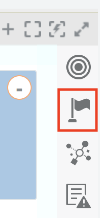
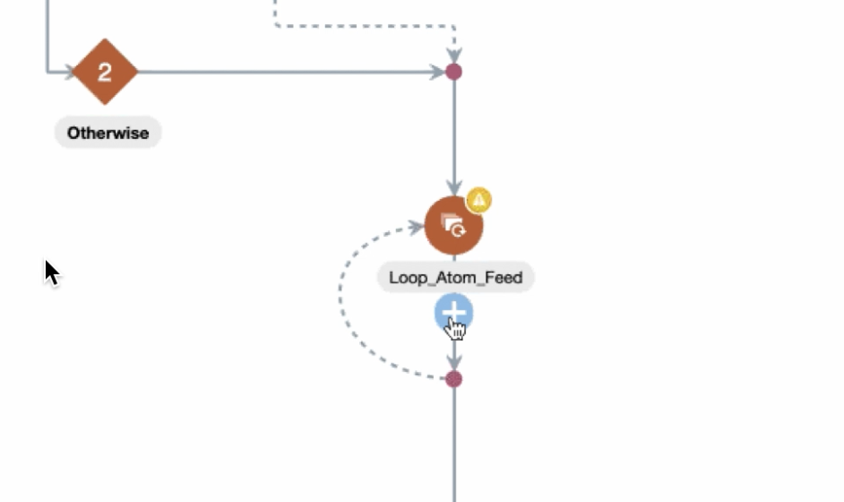
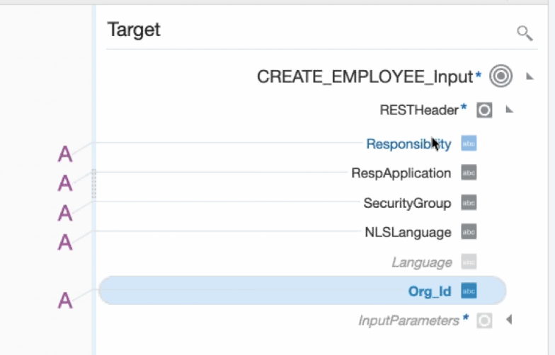

# **Lab 300 - Part B: EBS Connection**  
> ***Last Updated: February 2019***  

## **Introduction**

> This lab is part of a series of **OIC Development** workshops created to provide users with hands-on experience building functional integrations in the cloud using Oracle Integration Cloud. In this lab, we will build an integration that calls Fusion HCM to get employee details and writes those details to EBS. 

## **Objectives**

> 1. Add a Switch Action and configure a condition.
> 2. Add a Loop Action.
> 3. Learn how to configure EBS connection.
> 4. Mapping to EBS Connector.
> 5. Activate the Integration.

## **Pre-Requisites**
 
 - **REQUIRED:**

    - Workshop participant or lab instructor should have already completed [Lab 300A](/oic300a.md): Pre-Development for this Lab

 - **RECOMMENDED:**

    - Workshop participant should have already completed [Lab 100](/oic100.md): Explore Oracle Integration Cloud

## **Getting Started**

## **300b.1: Add a Switch Action and Configure a condition**

- To add a conditional statement, click on the flag icon 

- Drag and drop the Switch Icon (found under the Collection label) to the integration flow directly under the _countOfNewHires_ icon
 

- To configure the condition, start by clicking on the icon in the first branch of the fork and click on the pencil icon to open the configuration

 

- Drag and drop _$AtomFeedResponseCount_assignment_1_ form the source panel to the expression builder
 
 

- Assign 0 to it. Then Validate and Close the window.

 
 

- Complete the branch by adding in a "Stop" action found under the action menu under the End menu item and save the integration

## **300b.2: Add a Loop Action**
- Select _Loop_ from the Action Tab

- Name: **_ForEachEntry_**

- Description is optional
- Repeating Element: drag and drop 

**_$EmployeeNewHireFeedWithBO_Update_** from the source to the field name
- Current Element Name: **_CurrentElement_**

- Then Click Create to be returned to the main integration flow

## **300b.3: Add EBS Connection to the Orchestration**

---

- Select *Invoke* by clicking on plus sign right under _Loop_Atom_Feed_

- Select *Oracle E-Business Suite* connector types then click on the connector you just created.

- In the *Basic Info* section of the _Configure Oracle E-Business Suite Adapter Endpoint_ wizard, give the endpoint a name like `EBS_Create_Emp`.
	(_Note - In the figure it says createEBSOrder. In this lab, we'll proceed with EBS_Reference. But you can name anything._)

- After giving the invocation a name, select the *Next* button.

- In the *Web Services* section of the configuration wizard, for the *Product Family*, click on `=== Select ===` and then select `Human Resources Suite`.  

(Note all the other EBS products for which APIs are available)

- Next, for the *Product*, click on `=== Select ===` and then select `Human Resources`.  

(Note all the other EBS products for this suite which are available)

- Finally, for the *API*, scroll down and select the `Employee` API.  The *Internal Name* of `HR_EMPLOYEE_API` will automatically be populated.

- After selecting the API for the product family and product, select the *Next* button.

	

- In the *Operations* section of the configuration wizard, select the *Method* of `Create Employee`, then select the *Next* button.

Note that the *Service Status* of `Ready to Use` indicates that the API has already been provisioned earlier from the EBS Integration Repository.

- In the *Summary* section of the configuration wizard, review the EBS API which is going to be used, then select the *Done* button.

- Observe that both the mapping and invocation to the EBS adapter now show up in the orchestration. 

## **300b.4: Mapping to EBS Connector**

- Once the mapping editor is displayed, we can begin to map the variables. Open the Map

- First, we are going to map _RESTHeader_. 
- The first variable to map is _Responsibility_. Find it in your Target section. Click on the variable and select the option to _Create Target Node_. In the popped up window below select _A_ (it represents String Data Type) and insert US_HRMS_MANAGER. Validate the assignment. 

- If the assignment is successful, you are going to see a purple letter A next to the _Responsibility_ variable as it shown below. 

- Repeat above steps for the following target variables as it shown below.

	<table border=2, border-width=2>
	  <tr>
	    <th  style="background-color: #afafaf">Variable Name</th>
	    <th  style="background-color: #afafaf">Value</th>
	  </tr>
	  <tr><td>Responsibility</td><td>US_HRMS_MANAGER</td></tr>
	  <tr><td>RespApplication</td><td>PER</td></tr>
	  <tr><td>SecurityGroup</td><td>STANDARD</td></tr>
	  <tr><td>NLSLanguage</td><td>AMERICAN</td></tr>
	  <tr><td>Org_Id</td><td>201</td></tr>
	</table>

- After completing the last step, your Target side is going to look like it shown below.

- Now, let's map _InputParameters_.

- On your right side of mapping find _P_HIRE_DATE_ variable and add `fn:current-date()` to its Expression. The result should look as it shown below. Do not forget to validate each assignment before continuing to the next variable.

- Repeat above steps for the following target variables as it shown below.

	<table border=2, border-width=2>
	  <tr>
	    <th  style="background-color: #afafaf">Variable Name</th>
	    <th  style="background-color: #afafaf">Value</th>
	  </tr>
	  <tr><td>P_HIRE_DATE</td><td>fn:current-date()</td></tr>
	  <tr><td>P_BUSINESS_GROUP_ID</td><td>202</td></tr>
	</table>

- The variables below are required to find corresponding values from the left side of mapping (those values are coming from HCM for each employee)

	<table border=2, border-width=2>
	  <tr>
	    <th  style="background-color: #afafaf">Variable Name</th>
	    <th  style="background-color: #afafaf">Value</th>
	  </tr>
	  <tr><td>P_LAST_NAME</td><td></td></tr>
	  <tr><td>P_FIRST_NAME</td><td></td></tr>
	  <tr><td>P_SEX</td><td></td></tr>
     <tr><td>P_EMAIL_ADDRESS</td><td></td></tr>
     <tr><td>P_NATIONAL_IDENTIFIER </td><td></td></tr>
	</table>

- Make sure your mapping looks like it shown below.

> - _P_LAST_NAME_

> - _P_FIRST_NAME_

> - _P_SEX_

> - _P_EMAIL_ADDRESS_

> - _P_NATIONAL_IDENTIFIER_ ( PersonNidDetails -> NationalIdentifierNumber )

- Ypur final mapping should look as it shown below. 

- Validate your mappings and Close the window.

- We just finished a simple mapping that will allow EBS to synchronize an employee that had been created in HCM.

- At that point, your integration is supposed to look like it shown below.

## **300b.5: Activate the Integration**

- In this section we are going to activate our Integration and make it run. 

- Before the activation we need to assign **Tracking** so you can track fields during runtime. 

- Find the humburger sign on the right side of your integration window.

- On _Business Identifier For Tracking_ select _startTime_ and drag it to _Tracking Field_

- Make sure the tracking is assigned. Save it. 

- Save the Integration and Close the window.

- From the list of integrations in the OIC designer page, find your integration and click the slider to activate the integration.

-  In this menu, check the box to enable tracing.

- A new checkbox will populate under it, check that box to include the payload so that we can see the data flow on the monitoring page. Once completed, click Activate and wait for the page to load 

- An activated integration turn the slider green. Select the hamburger menu.

- Congratulation! Your Integration was successfully activated.