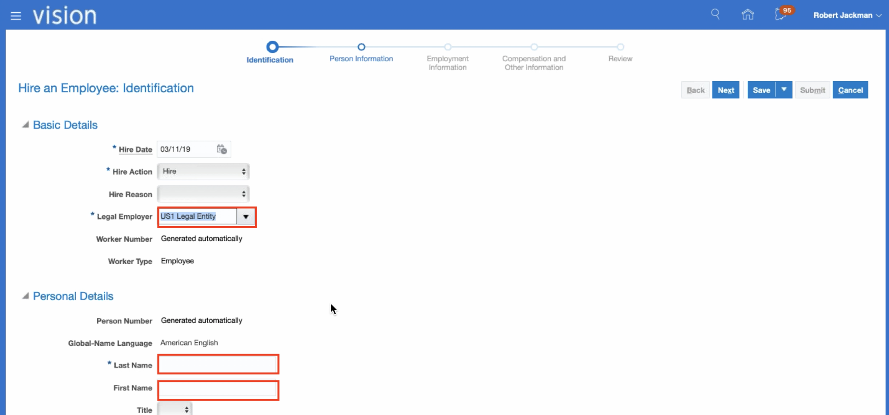
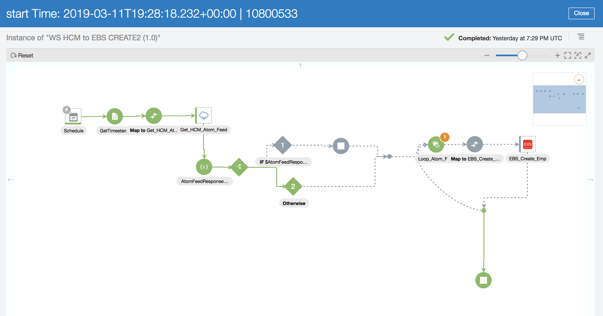

# **Lab 400  Run Scheduled Integration between HCM and EBS**   

## **Objectives**

> 1. In this Lab we are going to run an Integration that we finished building in Lab300b. 

## **Pre-Requisites**
 
 - **REQUIRED:**

    - Workshop participant or lab instructor should have already completed [Lab 300B](/oic300a.md).

### **400.1 Log in to HCM application**
- Once you are in HCM, select **My Team** -> **New Person**

- On _New Workers to Process_ window select a side bar button as it shown below.

- Select _Hire an Employee_ option.

- On _Hire an Employee: Identification_   fill in **Legal Employer** - US1 Legal Entity, **Last Name**, **First Name**, and **Gender**.

- Click the Next and provide the highlighted below information.

- Fill in the required fields.

- Next

- Save and Submit

### **400.2 Submit your Integration**

- Come back to your Integration list and find the one that you built. Click on a humburger sign and select _Submit Now_

- You are going to see a green header pops up at the top. Select the given _request id_. 

- You are going to be redirected to _Track Runs_ window.

- Give it a couple of seconds to process and then click to refresh.You are going to see that your Integration either is Successful or Failed.

- Then, click on _RUN ID_ as it shown bellow.

- And choose the tracking part as it shown bellow.

- Here you can see the flow of your integration. If everything was completed correctly, your integration should be highlighted with green. 

### **400.3 Find a newly created employee in EBS**

- **Required Artifacts:**
- **Set up EBS in your local PC**

- In order to run EBS instance successfully, you need to use Firefox 45. Download one if you do not have it.

 

- Open your System Preferences

- Open Java Control Panel

- In Java Control Panel select **Web Settings** and add an url of your EBS instance as it shown below. 

- Login into EBS application. Use Firefox 45 to open the application.

- On the right side, click on a hamburger sign and select the tabs as it shown below.

- Once you see that window appears, type the Last Name of the new employee that you created in HCM.

- By clicking _Find_, you will see the details of that employee appear on the screen.

### **THIS LAB IS NOW COMPLETED**